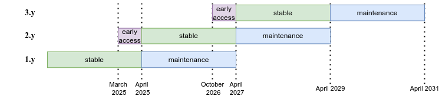

# JaiaBot Repositories
The JaiaBot source code lives in the `jaiabot` Git repository (<https://github.com/jaiarobotics/jaiabot>).

It consists of source code that is compiled into a variety of binary applications and libraries to be run on the target platforms (vehicles and base station computers). This compilation can be carried out manually by the developers on their computers and automatically be the CircleCI service for the target hardware. See [Building and CI/CD](page020_build.md) for more details.

* `jaiabot`
  * `src`: Source code (C++ primarily) that is built into compiled code (binaries and libraries)
    * `src/sh`: Shell and Python scripts that are installed onto and run by the system (via `install()` rules in `src/sh/CMakeLists.txt`)
  * `scripts`: Scripts run manually by developers as needed; these are never installed onto a system
  * `rootfs`: Root filesystem generation for jaiabot.
  * `debian`: Debian packaging files for jaiabot.

## Scripts: `scripts` versus `src/sh`

There is a clear separation between scripts that are installed and run on the system versus those used by people:

- `src/sh`: installed by CMake (into `${CMAKE_INSTALL_BINDIR}`, and copied into the build tree's `bin` directory) and run by the system or by users of a deployed system. Organized into:
  - `src/sh/system`: system maintenance/monitoring scripts, plus the MOTD script (`75-jaiabot-status`)
  - `src/sh/fleet`: fleet configuration scripts used by `jaia admin fleet ...`
  - `src/sh/init`: symbolic link to `rootfs/customization/includes.chroot/etc/jaiabot/init` (the first-boot files baked into the image)
  - `src/sh/data-offload`: data offload pre/post scripts
  - `src/sh/firmware`: firmware/payload board scripts
  - `src/sh/utils`: user-facing utilities (e.g. `jaia-doc.py`, `jaia-vpn-gen.sh`, geotiff tools)
- `scripts`: developer-only tooling, never installed. Organized into:
  - `scripts/build`: build, deploy, packaging and toolchain setup scripts
  - `scripts/dev`: miscellaneous developer helpers
  - `scripts/git-hooks`: git hook configuration (including the vendored clang-format hooks)
  - `scripts/hardware`: scripts for working with attached hardware (IMU, XBee, STM32, etc.)
  - `scripts/log-analysis`: log/offload analysis tooling
  - `scripts/packages`: apt repository management scripts (run on packages.jaia.tech)
  - `scripts/sim-docker`: Docker-based simulator
  - `scripts/svp`, `scripts/util_helpers`: analysis helpers
  - `scripts/test`: scripts for testing the setup/build process
  - `scripts/common-versions.env`: shared version definitions, sourced by CMake, CI and many scripts

If you add a new script, put it in `src/sh` only if it needs to be installed onto a bot, hub or cloudhub; otherwise it belongs in `scripts`.

# Release Branches

`jaiabot` manages several release series at once (up to three supported, and two unsupported):
 - *Development  (unsupported)* - Code under active development until first release
 - Early Access - Code for six months after first release.
 - Stable - Stable code that receives regular feature updates, bug patches and security updates.
 - Maintenance - Code that does not receive new features, but is still receiving bug patches and security updates.
 - *Legacy (unsupported)* - Code after Ubuntu end of life.

The lifecycle of supported releases is given in this figure:




## Ubuntu Releases
Each `jaiabot` release series is aligned to an long-term support (LTS) release of Ubuntu (except 1.y which supports two LTS releases as a special case):
- jaiabot 1.y: Ubuntu 20.04 (focal) and 22.04 (jammy)
- jaiabot 2.y: July 2025: Ubuntu 24.04 (noble)
- jaiabot 3.y (expected Oct 2026): Ubuntu 26.04 (resolute)

## Updates to create new release branch

Whenever a new release branch is created, the following must be done:

- Update text in this document for Active/Stable/Maintenance branches.
- Create new release branch (X.y) where X is one greater than the current Testing. For example, `git checkout -b 2.y 1.y`
- Update `jaiabot/scripts/common-versions.env` with the new Ubuntu version to support by default (e.g., 'noble') and this new release branch (e.g., '2.y').
- Update `jaiabot/scripts/packages/update_gobysoft_mirror.sh` to include an entry for the new release branch and add a 'distros_for_releases' key mapping the supported Ubuntu distros for this release branch (comma separated).
  -  Copy to /opt/jaia_packages on packages.jaia.tech.
  - Run ./update_gobysoft_mirror.sh on packages.jaia.tech to pull the new staging mirror for this release branch.
- Update `jaiabot/.circleci/config.yml`:
	-  Change to new release branch in all the "filter-template-*" lists.
	-  Change distros targeted by this release branch.
- Update entries for release, beta, continuous, and test for the new release branch to `jaiabot/.circleci/dput.cf`.
- Update `jaiabot/config/ansible/change-sources.yml` with the new release branch for variable "version".
- Add new directories to packages.jaia.tech:
```
release_branch=2.y
for repo in test continuous beta release; do
	sudo -E mkdir -p /var/www/html/ubuntu/${repo}/${release_branch}/mini-dinstall/incoming
done
sudo chown -R dput /var/www/html/ubuntu/
```
- Make a git tag and push it as a point of reference for commits until the first release, such as `git tag 2.0.0_alpha1 && git push --tags`.
- Update `.circleci/test_deb_repo.sh` to test for new release branch in non-standard branches

# Ubuntu Distributions

To add a new Ubuntu distribution:

- Update `jaiabot/scripts/packages/mini-dinstall.conf` and copy to packages.jaia.tech (in /opt/jaia_packages).
- On packages.jaia.tech, run:
```
sudo su dput
release_branch=2.y
for repo in test continuous beta release; do
    /usr/bin/mini-dinstall --batch --config=/opt/jaia_packages/mini-dinstall.conf /var/www/html/ubuntu/${repo}/${release_branch}
done
```
- Also on packages.jaia.tech update the staging mirror and manually copy the new distro to release:
```
release_branch=2.y
new_distro=noble
sudo -E rsync -aP /var/spool/apt-mirror/staging/${release_branch}/mirror/packages.gobysoft.org/ubuntu/release/${new_distro} /var/spool/apt-mirror/release/${release_branch}/mirror/packages.gobysoft.org/ubuntu/release/
```

- Symlink old docker (preferred) or create new for new distro in `jaiabot/.docker`
- Run `docker-create-push-for-circleci.sh {distroname}`
