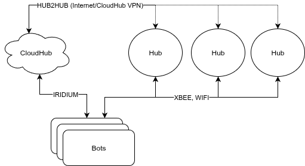

# Communications

The Jaia bots and hubs communicate using several types of wireless radio:

- 802.11 Wifi (Internet Protocol): "WIFI"
- XBee radio (XBP9X-DMUS-001 or XBP9B-DMSTB002): "XBEE"
- Iridium satellite Short Burst Data (SBD): "IRIDIUM"
- Wireguard CloudHub VPN (Internet Protocol): "HUB2HUB" [for communication between the hubs only]

These comms links can be visualized as:



Not all fleets will have all communications links. The minimum for a functioning system is currently:
- Physical hub with XBee or
- CloudHub with Iridium


Depending on the fleet hardware configuration and deployment needs, one or more of these links can be enabled to be used simultaneously for operational communications (BotStatus, Command, etc.). For data offload, only the WIFI link is used.

Bot to Hub communications (and vice-versa) is based on the [intervehicle layer](https://goby.software/3.0/md_doc210_transporter.html#autotoc_md57) of the Goby3 middleware. This is a publish/subscribe model, with explicit messages sent to initiate actual communications over the radio link  (subscription forwarding).

Each physical radio is interfaced with using a driver implemented from `goby::acomms::ModemDriverBase`:

- The XBee driver is in the `jaiabot` repository in the `src/lib/comms/xbee` directory
- The UDPDriver is forked (to provide multi-hub support) from Goby3 is used to use for Wifi communications and is in the `jaiabot` repository in the `src/lib/comms/wifi` directory. 
- The Iridium drivers (DRIVER_IRIDIUM and DRIVER_IRIDIUM_SHORE) from Goby3 are used for Iridium.

Data offload is not sent via Goby3 but rather  uses `rsync` over SSH.

## XBee

The XBee radios (Digi XBee-PRO 900HP S3B Radio) have two operating modes. They can act as wireless serial ports in their default "transparent" mode, or they can act as packet-based radios in their "API" mode. The Jaia XBee driver uses the radios in the "API" mode which uses a combination of AT commands (Hayes radio) and Digi API (binary) commands over serial.

See this document for documentation on the XBee radio and its software interface:

- <https://www.digi.com/resources/documentation/Digidocs/90002173>

### Software components

The XBee driver is comprised of two main components:

- `jaiabot::comms::XBeeDriver` which implements `goby::acomms::ModemDriverBase`
- `jaiabot::comms::XBeeDevice` which talks directly to the serial device and XBee radio. Each `XBeeDriver` contains an `XBeeDevice`.

### XBeeDriver Configuration

The XBee driver takes the following configuration (within `gobyd`'s configuration) as an extension to the `goby.acomms.protobuf.DriverConfig` Protobuf message (see `jaiabot/src/lib/messages/xbee_extensions.proto`):

```
   driver_cfg {
      driver_name: "xbee_driver" # fixed
      serial_port: "/dev/xbee" # set to Xbee serial port
      serial_baud: 9600
      modem_id: N # the current modem id
      ...
      [xbee.protobuf.config] {  #  (optional)
        network_id: 7  # Network ID for this fleet (must match 
                       # other peers in fleet): sets Xbee 
                       # ATID=network_id (optional) (default=7)
        test_comms: false  # If true, enables testing 
                           # functionality and diagnostics 
                           # (optional) (default=false)
        xbee_info_location: "/etc/jaiabot/xbee_info.pb.cfg"  
                                              # Location to write 
                                              # a file with serial 
                                              # number and node id 
                                              # to be used by 
                                              # jaiabot_metadata 
                                              # (optional) 
                                              # (default="/etc/jaiab
                                              # ot/xbee_info.pb.cfg"
                                              # )
        hub_id:   # If this node is a hub, set its hub_id here. 
                  # (optional)
        use_xbee_encryption: false # This is used to determine if we should enable AES-128 encryption.
                                   # If true, then all systems will need to use encryption.
                                   # Advanced Encryption Standard (AES-128)
                                   # (optional) (default=false)
        xbee_encryption_password: "" # This is used for the encryption password. 
                                     # Password is a 128 bit value (16 bytes)
                                     # (optional) (default = "") 
      }
    }
```


The `encryption` settings must match for the fleet.

An example configuration for hub 1 in a two bot/two hub fleet is:

```
    driver { 
        driver_name: "xbee_driver"
        serial_port: "/dev/xbee"
        serial_baud: 9600
        modem_id: 1
        [xbee.protobuf.config] {
            network_id: 0
            hub_id: 1
            use_xbee_encryption: false 
            xbee_encryption_password: "" 
        }
    }
```

and for bot 0 in the same fleet:

```
    driver { 
        driver_name: "xbee_driver"
        serial_port: "/dev/xbee"
        serial_baud: 9600
        modem_id: 2
        [xbee.protobuf.config] {
            network_id: 0
            use_xbee_encryption: false 
            xbee_encryption_password: "" 
        }
    }
```

### XBeeDriver Wire protocol

The XBeeDriver converts the required parts of `goby::acomms::protobuf::ModemTransmission` (with a single data frame, max_frame_size = 1) into the `xbee::protobuf::XBeePacket` Protobuf/DCCL message and encodes it using [DCCL](https://libdccl.org) (but removes the 2 ID bytes as these are unnecessary as the XBeePacket is the only message sent on the XBee link). This resulting encoded DCCL message (minus the first 2 bytes) is sent as the payload of the XBee API Transmit Request (0x10) message. 

ACKS are implemented by sending an XBeePacket with `type = ACK` set and the appropriate `acked_frame` for the frame being acked.

`XBeePacket` is defined in `jaiabot/src/lib/comms/xbee/xbee.proto`. The XBee radios have a packet payload size of 256 bytes. With the required header items from `ModemTransmission`, the XBeeDriver can currently support DCCL message payloads up to 250 bytes (max_frame_size = 250).

## Multiple hub support

Jaia fleets can support multiple hubs within a fleet (either physical Hubs or a CloudHub). For physical hubs, this is managed using the *same* physical XBee serial ID for all hubs, and the same Goby modem_id.

The single modem id `1` is used for all hubs. Thus, within a given subfleet, modem id `1` is always the hub, and modem ids `2` to `N+2` are used for all the bots 0 to N.

The following sequence diagram illustrates this process by using the example of hub0 and hub1 being used together in the same fleet. hub1 is turned on (or the bots come into range of hub1) at some later time.

The bots will re-subscribe regularly (currently every 60 seconds on XBee), which ensures that a Hub that is present later (or reboots) will always get the subscriptions after no more time has passed than the re-subscription interval.


### Hub2Hub Comms

The HUB2HUB link provides UDP messaging between hubs using the CloudHub VPN. This uses the same Goby intervehicle comms as the Bot/Hub communication, and uses the same driver as the WIFI link.

A single message type (`jaiabot::protobuf::Hub2HubData`) is used on this communications link. Each hub subscribes to all the other hubs defined in the `/etc/jaiabot/inventory.yml`, and resubscribes regularly in the event of a hub reboot or later power-on of a hub.

The `Hub2HubData` message carries one of the following payloads:

- **`bot_status`**: A `BotStatus` received by the originating hub from a given bot in range.
- **`task_packet`**: A `TaskPacket` received by the originating hub from a given bot in range.
- **`command_for_bot`**: A `Command` sent by JCC connected to the originating hub. This allows hubs that are in range of the target bot to relay the command. Only locally-originated commands are forwarded (i.e., commands received from other hubs via `Hub2HubData` are not re-forwarded to avoid message loops).
- **`command_comms_result`**: A `CommandCommsResult` generated by the originating hub when it receives an acknowledgement or expiry for a command it sent to a bot. This allows JCC on other hubs to see the delivery status of commands they originated.
- **`hub_status`**: A `HubStatus` published by the originating hub on each loop iteration, so all hubs in the fleet can track the status of every other hub.

#### Data flow

All Hub2HubData processing takes place in `jaiabot_hub_manager`. When it receives a `Hub2HubData` message from another hub via the HUB2HUB intervehicle link, it calls `handle_hub2hub_data()` which dispatches on the payload type:

- **`bot_status`**: Calls `handle_bot_nav()` (with `from_other_hub=true`), which publishes the status on the interprocess `bot_status` group. `jaiabot_web_portal` receives it via its normal `bot_status` subscription and forwards it to JCC.
- **`task_packet`**: Calls `handle_task_packet()` (with `from_other_hub=true`), which publishes the packet on the interprocess `task_packet` group. `jaiabot_web_portal` receives it via its normal `task_packet` subscription and forwards it to JCC.
- **`command_for_bot`**: Calls `handle_command()` (with `from_other_hub=true`) to relay the command to the bot if it is in range, and publishes the command on the interprocess `remote_hub_command` group (with `from_hub_id` set). `jaiabot_web_portal` subscribes to `remote_hub_command` and notifies JCC clients via the `remote_command` field in `PortalToClientMessage`. The `from_other_hub=true` flag prevents the relayed command from being re-forwarded over Hub2HubData, avoiding message loops.
- **`command_comms_result`**: Publishes the result on the interprocess `hub_command_result` group. `jaiabot_web_portal` receives it via its normal `hub_command_result` subscription and forwards it to JCC.
- **`hub_status`**: Publishes the status on the interprocess `hub_status` group. `jaiabot_web_portal` receives it via its normal `hub_status` subscription and forwards it to JCC.

All `PortalToClientMessage` messages include a `hub_id` field that identifies the originating hub. For locally-generated messages, `hub_id` is set from the application configuration (populated via `config/gen/hub.py`). For messages that originated from a remote hub, `hub_id` is carried through the interprocess data (e.g. the `BotStatus.hub_id` or `CommandCommsResult` fields) and set accordingly before sending to JCC. This allows JCC to distinguish which hub generated each message.


## Iridium

Iridium satellite communications provides global coverage using the Short Burst Data (SBD) message protocol. While this provides the convenience of fully remote and over-the-horizon operations, it introduces some additional complexity for setup.

Iridium SBD is inherently asymmetric: The bots are equipped with a modem (Iridium 9603) that is referred to by Iridium as an "ISU" (Iridium Subscriber Unit). This device uses a Hayes-type protocol (AT messages) over serial and is managed by the Goby3 DRIVER_IRIDIUM driver.

The hub is virtualized (CloudHub: see [Cloud Computing](page056_cloud.md)) and runs effectively a TCP client/server pair for inbound/outbound communications using Iridium's "DirectIP" protocol from to and from their servers. This is a binary protocol unrelated to the Hayes protocol on the bot side and is managed by the Goby3 DRIVER_IRIDIUM_SHORE driver.

Some more terminology:

- Mobile Terminated (MT): Messages from the hub to the bot
- Mobile Originated (MO): Messages from the bot to the hub
- International Mobile Equipment Identity (IMEI): a unique 15-digit serial number assigned to every mobile phone (included Iridium ISUs). This is used to address messages to bots (MT) and identify the source of messages from a bot (MO). 

### Message routing and multiplexing

For security (by not directly exposing ports on Cloudhub) and as Iridium charges for each IP address provisioned to send MT messages, we have chosen to multiplex our SBD messages through a separate AWS server (iridium.jaia.tech / 44.233.97.88).

The figure below diagrams the flow for messages between the bots and hubs using this intermediate server, as well as Iridium's servers.


Communication between the Cloudhub and iridium.jaia.tech happens within the Cloudhub (Wireguard) VPN, where iridium.jaia.tech is assigned the address of hub25 (and Cloudhub is hub30 as usual). 
