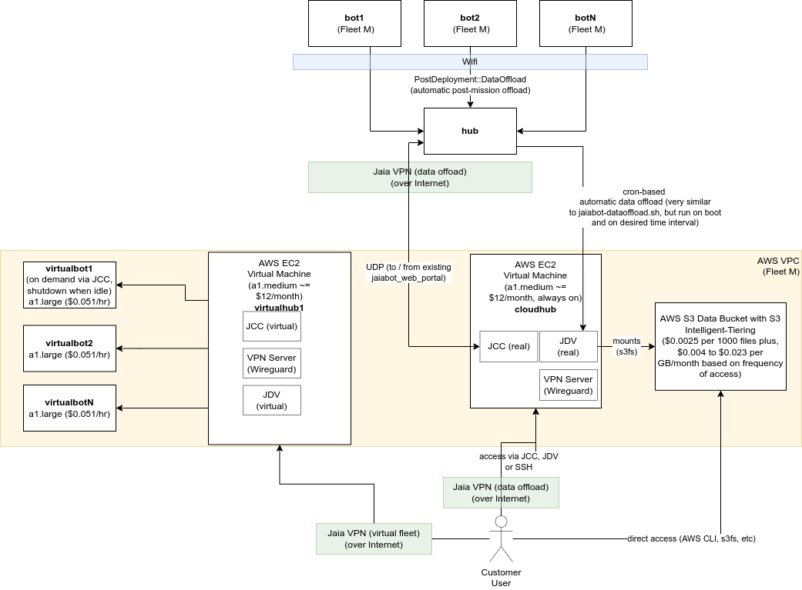
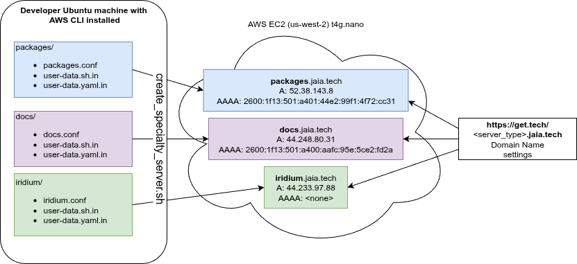
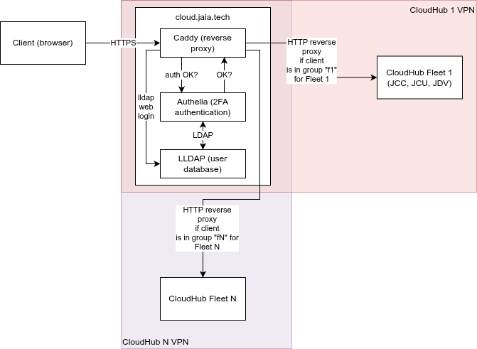

# Cloud Computing

The Jaia Cloud is designed to provide:
- VirtualFleet: remote access to simulated fleets (intended to be a nearly identical "digital twin" of the corresponding real fleet, if one exists) for user training and scenario planning.
- CloudHub: 
	- remote mission planning and control of real fleets over the internet.
	- remote access to data storage, analysis and visualization.
	- control (start/stop/delete/create) of VirtualFleet

It is possible to have a VirtualFleet without a corresponding real fleet or vice-versa. 




## Definitions

### Jaia Terms
- Cloud - remote internet-connected on-demand computing provided (in this case) by Amazon Web Services (AWS) on the Elastic Compute Cloud (EC2) virtual machine system.
- CloudHub - A hub that lives in the Cloud. This machine is always-on. CloudHub always uses the Hub ID 30 with a given fleet. CloudHub can be one of two forms based on the communications links that are configured:
   - Primary Cloudhub: This is a full featured hub running nearly the same software as a physical hub. It can only use the communications links that make sense over such a distance (currently Iridium, but not XBee or Wifi).
   - Secondary Cloudhub: Essentially a "copy" (or secondary hub) of the real fleet's hub (or primary hub) that lives in the cloud rather than in the physical hub hardware. This can send commands / receive data from the real fleet efficiently. It is also used to manage the VirtualFleet. 
- VirtualFleet -  a set of VirtualBots and VirtualHubs that run in the cloud on virtual machines.
- VirtualBot - an amd64 version of the real bot that differs in that all the sensors/actuation are hooked up to simulators rather than the real hardware.
- VirtualHub - Similar to VirtualBot, just for a hub.

### Amazon Web Services (AWS) Terms

- EC2 - Elastic Compute Cloud: AWS's Virtual Machine infrastructure.
- S3 - Simple Storage Service: AWS's data storage in the cloud with variable access latencies and corresponding costs.
- VPC - Virtual Private Cloud: a collection of networking components (subnets, internet gateways, firewall rules, etc) in an isolated environment from other VPCs that might exist in Jaia's or a customer's EC2 account for a given region.

## Architecture

Each VPC has one and only one fleet. At a minimum this is a CloudHub machine, which is always on.


### VPC 

The components of the VPC include:

- Subnets:
	+ jaia__Subnet_CloudHub: A subnet for Cloudhub alone.
	+ jaia__Subnet_VirtualFleet_WLAN: A subnet for the VirtualFleet (uses the same private IP addresses as the real fleet's wireless LAN.
- Route tables:
	+ jaia__RouteTable: A simple routing table that sends all non LAN traffic to the internet gateway.
- Internet gateway:
	+ jaia__InternetGateway: A simple internet gateway with default configuration.
- Elastic IPs:
	+ jaia__CloudHub_VM__ElasticIP: A public IPv4 address for access to CloudHub.
- Security Groups (Firewalls):
	+ jaia__SecurityGroup_CloudHub: Allows access to VPNs only running on CloudHub.
	+ jaia__SecurityGroup_VirtualFleet: Allows access only within private network (jaia__Subnet_VirtualFleet_WLAN).
- Instances (Virtual Machines):
	+ CloudHub
		* CloudHub VPN
		* VirtualFleet VPN
	+ (optionally) VirtualHub1
	+ (optionally) VirtualBot1-N

## Network addresses

The use of the `jaia ip` tool is recommended for determining IP addresses for a given node, id, fleet, etc.

The network address assignment for the Jaia Cloud is intended to complement the existing fleet specific [VPN](page055_vpn.md). This means that a given fleet may have up to three VPN subnets assigned:

1. Real "fleet VPN": The fleet VPN for remote support (vpn.jaia.tech) - UDP port 51821 + fleet ID. Managed by vpn.jaia.tech.
2. "VirtualFleet VPN": The virtual fleet VPN for access to the "digital twin" virtual fleet - UDP port 51820. Managed by the fleet's CloudHub.
3. "cloudhub VPN": The data offload / remote control VPN for access to the real fleet from the CloudHub - UDP port 51821. Managed by the fleet's CloudHub.

These all need to be different because:

- The customer may choose the host both the virtualfleet and cloudhub VPN on their own (secure) AWS account and not provide Jaia access.
- Some customers will not have a VirtualFleet at all.
- Some customers may want to restrict access to the Cloudhub to a different set of users than those who have access to the VirtualFleet (e.g., trainees not able to accidentally command real fleet).

Additionally, each VPC has two subnets assigned as previously mentioned:

1. CloudHub Subnet: 10.23.255.0/24 and 2001:db8:0:**0**::/64 where 2001:db8::/56 is replaced by the Amazon EC2 assigned IPv6 block for the VPC.
2. VirtualFleet WLAN Subnet: 10.23.{flt}.0/24 and 2001:db8:0:**2**::/64 where 2001:db8::/56 is replaced by the Amazon EC2 assigned IPv6 block for the VPC.

### IPv4 

1. Fleet VPN: The IPv4 addresses remain as assigned in [VPN](page055_vpn.md) document: 172.23.flt.bot_or_hub, where flt = Fleet ID, bot_or_hub = 10 + hub ID or 100 + bot ID.
2. VirtualFleet VPN / CloudHub VPN: No IPv4 addresses are assigned except for the VPN server itself (to allow connections from IPv4 only customers).

### IPv6 

#### Prefix

The prefix is `fd00::/8` for unique local addresses as defined in [RFC4193](https://www.rfc-editor.org/rfc/rfc4193.html).

The full 48-bit prefix was (pseudo)-randomly generated as per RFC4193 for each of the three VPN classes.

| VPN Class        | IPv6 Prefix             |
|------------------|-------------------------|
| Fleet VPN        | `fd91:5457:1e5c::/48`   |
| VirtualFleet VPN | `fd6e:cf0d:aefa::/48`   |
| CloudHub VPN     | `fd0f:77ac:4fdf::/48`   |
| Physical WLAN    | `fddd:7f2e:3258::/48`   |

#### Subnet 

For each VPN class, the Subnet ID is the Fleet ID, so for example, VirtualFleet 3 would have the subnet `fd6e:cf0d:aefa:3::/64`. This allows up to 2^16 = 65536 fleets to be assigned.

#### Address

For a given node (bot or hub) on the VPN, the 64-bit interface identifier is given as `::0:hub_id` for hubs, `::1:bot_id` for bots, and `::2:customer_id` for various customer machines (desktop / laptop / tablet). This allows up to 2^16 = 65536 bots and hubs to be assigned per fleet.

Some examples include:

| Bot (b) or Hub (h)? | ID  | Fleet     | Fleet VPN Address (s) |  VirtualFleet VPN (v) Address (fN)  |  CloudHub VPN Address (c) |
|-----------|-------------|-----|--------------------|--------------------|--------------------|
| Bot         | 5   | 4        | `fd91:5457:1e5c:4::1:5` | `fd6e:cf0d:aefa:4::1:5` | `fd0f:77ac:4fdf:4::1:5` |
| Bot         | 6   | 250      | `fd91:5457:1e5c:fa::1:6` | `fd6e:cf0d:aefa:fa::1:6` | `fd0f:77ac:4fdf:fa::1:6` |
| Hub         | 20 | 10       | `fd91:5457:1e5c:a::14` | `fd6e:cf0d:aefa:a::14` | `fd0f:77ac:4fdf:a::14` |
| Hub (CloudHub (ch))        | 30 | 15       | `fd91:5457:1e5c:f::1e` | `ffd6e:cf0d:aefa:f::1e` | `fd0f:77ac:4fdf:f::1e` |

You can generate the values for the table above yourself using:
```
jaia ip b5sf4
jaia ip b5vf4
jaia ip b5cf4

jaia ip b6sf250
jaia ip b6vf250
jaia ip b6cf250

jaia ip h20sf10
jaia ip h20vf10
jaia ip h20cf10


jaia ip h30sf15
jaia ip h30vf15
jaia ip h30cf15
# OR
jaia ip chf15
```

## AWS tags

### AMI

- Name: jaiabot__rootfs-feature_aws-cloud-v3.0.0
- jaiabot-rootfs-gen_version: 3.0.0
- jaiabot-rootfs-gen_repository: release
- jaiabot-rootfs-gen_repository_version: 3.y
- jaiabot-rootfs-gen_build-date: Fri 08 Dec 2023 02:20:27 UTC
- jaiabot-rootfs-gen_build-unixtime: 1702002064

### VPC components (including Instances)
- Name: jaia__COMPONENT__CUSTOMER_NAME: COMPONENT is VPC, Subnet, SecurityGroup, etc.
- jaia_customer: CUSTOMER_NAME
- jaiabot-rootfs-gen_repository: same as AMI
- jaiabot-rootfs-gen_repository_version: same as AMI.
- jaia_fleet: Fleet ID


### VM Instances

- all:
	- Name: jaia__CloudHub_VM__CUSTOMER_NAME, jaia__VirtualHubN_VM__CUSTOMER_NAME, or jaia__VirtualBotN_VM__CUSTOMER_NAME
	- jaia_instance_type: cloudhub, virtualfleet
- VirtualBot/VirtualHub:
	+ jaia_node_id: Bot ID or Hub ID
	+ jaia_node_type: "bot" or "hub"

## Usage

Once connected to the appropriate VPN and hosts are configured in `/etc/hosts`, one can open a web-browser as usual to JCC, etc.

For fleet1, these would be:
```
# /etc/hosts
fd6e:cf0d:aefa:2::1 hub1-virtualfleet1
fd0f:77ac:4fdf:2::1e cloudhub-fleet1
```

- http://cloudhub-fleet1 for CloudHub JCC (remote command and monitoring of real fleet).
- http://cloudhub-fleet1:9091 for CloudHub Jaiabot Fleet Upgrade and Configuration (for updating CloudHub itself, starting/stopping of the VirtualFleet).
- http://hub1-virtualfleet1 for the VirtualFleet JCC (command and monitoring of Virtual Fleet).
- http://hub1-virtualfleet1:9091 for the VirtualFleet Jaiabot Fleet Upgrade and Configuration (for updating the VirtualFleet).

## Specialty Servers

In addition to the CloudHub and VirtualFleet mentioned above, Jaia runs a number of "speciality" AWS servers, each with a specific primary task:

- `iridium.jaia.tech`: Multiplexing support for Iridium satellite messaging.
- `packages.jaia.tech`: Hosts Ubuntu (*.deb) packages
- `docs.jaia.tech`: Documentation
- `vpn.jaia.tech`: Service VPN for remote support.
- `*.cloud.jaia.tech`: Web access with 2-factor authentication for accessing CloudHubs.

We want to be able to recreate these servers from scratch for consistency of implementation, security, and AWS instance type. We want to be able to upgrade to the latest Ubuntu/Jaiabot release by rebuilding servers, and have the tools in place to recreate them in the event of an instance disk corruption or AWS failure.

This is done using a pair of scripts in `jaiabot/rootfs/cloud/aws`:
- `create_specialty_server.sh`: Creates the new AWS server from a configuration file.
- `delete_specialty_server.sh`: Deletes the existing AWS server(s) for a particular  server type (matching the SERVER_TYPE given in the configuration file of original invocation of `create_specialty_server.sh`). Primarily useful for developing a new server type configuration set when you need to create/delete the server multiple times. See "Upgrade an existing specialty server type" below for upgrading a live server.

Graphically, this is the relationship between the various components:



### Create a new specialty server type

To create a new specialty server type (which we'll call "foo") you need to create three files, and by convention these are put in a subdirectory with the same name:

- `jaiabot/rootfs/cloud/aws/foo`
	+ `foo.conf`
	+ `user-data.sh.in` or `user-data.sh`
	+ `user-data.yaml.in`
	
The `docs` and `iridium `server configurations are fairly simple, and one of these may be a useful starting point to copy for a new server configuration.
	
#### foo.conf
`foo.conf` is simply a bash shell script that is `source`d by `create_specialty_server.sh` and must define the following variables:
- `SERVER_TYPE=foo`: instance name, used to tag the instance and instance resources. Should match name of file and directory (`foo`).
- `ENABLE_TERMINATION_PROTECTION=true` or `false`: EC2 termination protection prevents against accidental deletion (termination) of a server unless termination protection is first removed in the console or using the AWS CLI. Useful to set `false` when testing creating a server (as you likely need to run `delete_specialty_server.sh` multiple times), but is important to set `true` once the server is in production to avoid accidental deletion.
- `DEBUG=true` or `false`: If true, outputs more information about what the script is doing.

`foo.conf` also must define the function `function create_security_group_rules()` which will be run (with the SECURITY_GROUP_ID as the only parameter) to allow the script to set the appropriate AWS firewall (security group) rules. Instances should restrict the allowed firewall inputs to the minimum necessary to allow functionality.

`foo.conf` can also optionally include:
- `ELASTIC_IP_ALLOCATION_ID=eipalloc-0b2441c45eff7c158`: This is an "elastic IP" address allocation ID for an existing IPv4 address that will be reassigned to this instance. It is typically convenient to reuse the Elastic IP between upgrades to the same server type so that the IP address remains the same as the old machine and thus the DNS record (A record) don't need to be changed. If unset, no Elastic IP will be set, and this should be done manually later in AWS Console. If it's a new server, you'll want to allocate an Elastic IP address manually in the console and assign a domain name A record (e.g., `foo.jaia.tech`) so that it can be reached conveniently. The domain name settings are done through https://get.tech/, not AWS.
- `IPV6_ADDRESS=2001:db8:ffff:ffff:ffff:ffff:ffff:ffff`: Assign this IPv6 address to the instance. If unset a new address will be assigned to the instance. Similarly to the ELASTIC_IP_ALLOCATION_ID, this should be set to upgrade an instance without having to change the domain name (AAAA) record. When creating a new server, you can leave this blank to let AWS allocate an IPv6 address, then just keep track of it for future upgrades.
- `ARCH=arm64`: Architecture for the instance (must match INSTANCE_TYPE architecture). Default is `arm64` to match `t4g.nano`
- `INSTANCE_TYPE=t4g.nano`: Instance type: default is `t4g.nano` (very small arm64 instance).
- `REGION=us-west-2`: Region, default is `us-west-2`
- `DISK_SIZE_GB=8`: Size of disk in GB (default 8).
- Any other variables to be used in preprocessing `user-data.*.in` (see below).

#### user-data.sh.in and user-data.yaml.in

These are template files for [cloud-init user-data](https://cloudinit.readthedocs.io/en/latest/explanation/format.html) configuration. Both must be included but one may be left empty, except for the header line. 

Minimal `user-data.sh.in` or `user-data.sh`:
```
#!/bin/bash
```

Minimal `user-data.yaml.in`:

```
#cloud-config
```

Both `*.in` configuration files are preprocessed using bash before being passed to cloud-init so that bash variables (`${}`) are expanded using the values in `foo.conf` and `jaiabot/scripts/common-versions.env`. If `user-data.sh` is specified instead, it will be used directly without preprocessing.

The contents of the preprocessed files are used by `cloud-init` to seed the new server instance. See the cloud-init documentation for more details.

#### Manual steps

Some servers will require manually copying data from the old server, or restoring a backup. For example, when upgrading the `packages.jaia.tech` server we copy the existing .deb files, etc. from the old server so that all of these `.deb` packages don't have to be rebuilt.

The `user-data.*.in` configuration files should install a script that can be run after the server is up and running. See the `/home/jaia/sync_from_prior_packages_server.sh` script installed by the `jaiabot/rootfs/cloud/aws/packages/user-data.sh.in` configuration file for an example.

The documentation for that server should describe the use of such a manual synchronization script.

#### Actually create the server

Run `create_specialty_server.sh foo/foo.conf` to create the new server. 

### Delete an existing specialty server type

When testing the creation of a new server type, you may be creating and deleting the server multiple times before you are satisfied with the new configuration. Here it is helpful to set:

`ENABLE_TERMINATION_PROTECTION=false`

so that you can easily delete the new server until it works correctly. Once you have a working server you can go in to the AWS console and enable termination protection for that instance (or delete and rebuild one last time with `ENABLE_TERMINATION_PROTECTION=true`).

### Upgrade an existing specialty server type

To upgrade an existing server, the following set of steps is recommended:

1. Remove (or comment out) the ELASTIC_IP_ALLOCATION_ID= and IPV6_ADDRESS= lines in the `{server_type}.conf` file so that the new instance does not replace the existing (live) old server's IP addresses.
2. Create the new instance using `create_specialty_server.sh`.
3. Test the functionality as much as possible using the new server but with its temporary IPv4/IPv6 addresses.
4. When this new server is deemed functional, swap the Elastic IP and IPv6 addresses from the old server to the new server in the console under `Actions->Networking->Manage IP addresses` for the new server. This makes the new server live, so be careful about the timing, depending on the server's usage.
5. Ensure the new server is fully functional now with these IP addresses (which should map to the correct domain names as well).
6. Power down (stop) the old server.
7. After some period (e.g., 1-2 weeks or so) of the new server functioning correctly,  disable termination protection for the old server and enable termination protection for the new server (if not already set) under (in the AWS console) `Actions->Instance Settings->Change termination protection`. Terminate (delete) the old instance.

## Cloud Login server (*.cloud.jaia.tech)




The Cloud Login Server (*.cloud.jaia.tech) manages user authentication (with 2-factor [2FA] verification) for access to CloudHub resources. This provides a more convenient way to access the JCC and other CloudHub applications without requiring that the client machine have the Wireguard VPN installed.

### Implementation

This server is implemented using three open source projects:

- [Authelia](https://www.authelia.com/) for authentication including 2FA (time-based one-time password, TOTP and WebAuthn which supports physical keys like Yubikeys).
- [Caddy](https://caddyserver.com/) for the reverse proxy features.
- [LLDAP](https://github.com/lldap/lldap): Light LDAP (Lightweight Directory Access Protocol) implementation for user management.

In short, Authelia manages authentication, Caddy manages the reverse proxy (between the insecure HTTP applications and the authenticated HTTPS connection), and LLDAP manages the user information (user names, group, passwords, etc.).

These all run on a single machine, cloud.jaia.tech.

### Available services

CloudHub access:
- https://fN.cloud.jaia.tech: JCC for Fleet N (e.g., https://f1.cloud.jaia.tech for fleet 1).
- https://fN.cloud.jaia.tech/jcu: JCU for Fleet N.
- https://fN.cloud.jaia.tech/jdv: JDV for Fleet N.

Supporting web pages:
- https://auth.cloud.jaia.tech: Authelia authentication website. Typically the user doesn't need to access this directly unless they want to change their user settings.
- https://lldap.cloud.jaia.tech: User management by Jaia administrators. Add new users, add users to fleet access, and remove old users.
