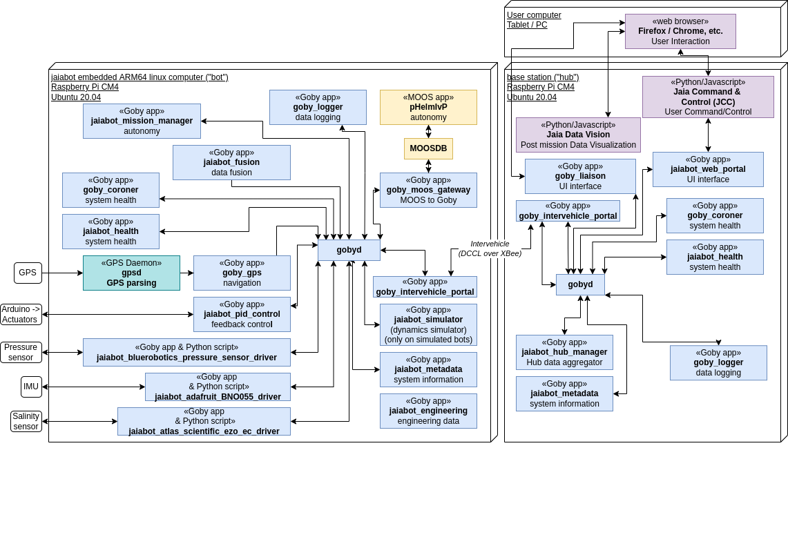

# Architecture

Preliminary JaiaBot system block diagram:

## Middlewares

`jaiabot` is based primarily on two publish/subscribe asynchronous middlewares:

- Goby3: <https://goby.software/3.0/>
- MOOS-IvP: <http://moos-ivp.org>

Goby3 forms the core of the communications design, providing interthread, interprocess, and intervehicle communications. MOOS-IvP provides the behavior-based autonomy implementation using the `pHelmIvP` multi-objective decision engine.

In addition, we expect to support clients using `ROS` in the future.

## Applications

### Goby Applications

#### In Goby3 project

- `goby_coroner`: Provides health status from the output of each of the Goby applications.
- `goby_gps`: Takes GPS data from `gpsd` and publishes it to the gobyd.
- `goby_liaison`: Host a web interface on the platform to view and send Goby messages.
- `goby_logger`: Subscribes to messages in the gobyd and logs them to the disk.
- `goby_moos_gateway`: Gateway to MOOS applications.
- `goby_ros_gateway`: Gateway to ROS middleware (not yet written).
- `goby_opencpn_interface`: Interface from Goby3 to OpenCPN (not run from systemd, but feel free to use in the simulator).
- `gobyd`: The Goby3 daemon which handles the publishing and subscribing.

#### In jaiabot project

- `jaiabot_adafruit_bno055_driver`: Middleman between our `jaiabot_imu_py` driver and the Goby system. Listens on UDP to Python driver and republishes as a Goby3 message.
- `jaiabot_as-ezo-ec_py`: Python driver for Atlas Scientific conductivity sensor.
- `jaiabot_atlas_scientific_ezo_ec_driver`: Middleman between our `jaiabot_as-ezo-ec_py` driver and the Goby system. Listens on UDP to Python driver and republishes as a Goby3 message.
- `jaiabot_bluerobotics_pressure_sensor_driver`: Middleman between our `jaiabot_pressure_sensor_py` driver and the Goby system. Listens on UDP to Python driver and republishes as a Goby3 message.
- `jaiabot_driver_arduino`: This is the driver for the Arduino which controls the elevators, rudder, motor, diagnostic LEDs, and power monitoring.
- `jaiabot_engineering`: Handles commands from the Engineering Interface web page to set and test low level functionality.
- `jaiabot_fusion`: Assembles the `goby::middleware::frontseat::protobuf::NodeStatus` message used by the `goby_moos_gateway` from the `goby_gps` output, pressure sensor, and other sources, as needed.
- `jaiabot_health`: Overall system health using data from `goby_coroner` and eventually other sources.
- `jaiabot_hub_manager`: Interface between the bots and the web sites. Sends and receives inter-vehicle messages on the radio and republishes / subscribes to their Goby3 counterparts on inter-process.
- `jaiabot_imu_py`: Python driver for Adafruit bno055 IMU.
- `jaiabot_metadata`: Logs information about the system including current jaiabot build number, current Goby3 build number, computing platform, etc.
- `jaiabot_mission_manager`: Keeps a state machine of the overall mission state and switches from pHelmIvP control to profile mode as required.
- `jaiabot_pid_control`: Determines values to output to motor and control surfaces via pid control loops
- `jaiabot_pressure_sensor_py`: Python driver for Blue Robotics Bar02 and Bar30
- `jaiabot_web_portal`: Interface between Goby3 and the Flask web server on the hub.

#### Potential future jaiabot project inclusion

- `jaiabot_power`: Power management and circuit control.
- `jaiabot_lights`: Light control (perhaps part of `jaiabot_power` instead?).
- `jaiabot_payload_interface`: Pluggable interface for different payload data feeds to be logged.

#### In the MOOS-IvP project

- `moosdb`: The main communication mechanism for all MOOS apps.
- `pHelmIvP`: Pluggable behavior based autonomy.
- `pNodeReporter`: Aggregates NAV_* variables into NODE_REPORT variable for pHelmIvP.
- `uprocesswatch`: Monitors the health of MOOS processes.
