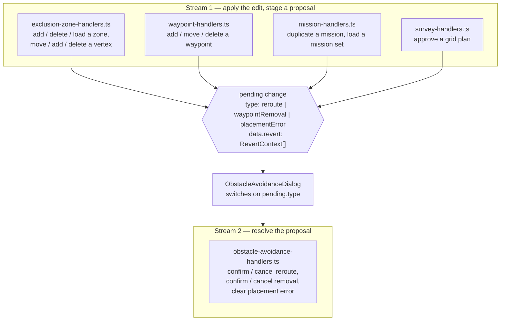
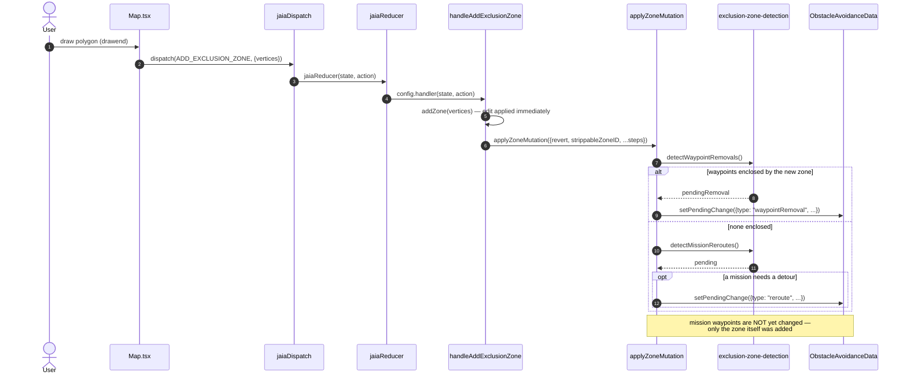

# Obstacle Avoidance in the JCC

Operators draw **exclusion zones** on the map — areas a bot must not enter. The JCC
plans routes around them in the browser, before a mission is ever sent to a hub, by
inserting **bypass waypoints** that detour around a zone and rejoin the operator's
original route.

This page covers how that machinery is arranged, the decisions behind how it behaves,
and a handful of rules that are easy to break when changing it. It assumes the
action/dispatch/handler/context model described in
[Developing with React Context](page111_developing_with_react_context.md).

## 1. Two event streams, not one pipeline

The feature is a fan-in / fan-out. **Twelve producer functions** across four handler
files each apply an operator's edit immediately and _stage a proposal_; **five consumer
functions** in one file resolve whatever was staged, without caring which producer
staged it.

**Detection never mutates anything.** `detectMissionReroutes()` and
`detectWaypointRemovals()` compute proposals from each mission's _clean_ waypoints —
the ones the operator placed, with bypass waypoints filtered out — and return them.
Only a consumer, acting on the operator's confirmation, writes a route back to a
mission.

That is why the contract between the streams is so small: a proposal, plus a
`revert: RevertContext[]` list describing how to undo the edit that produced it if the
operator declines. The consumers never inspect which producer fired.

### The producers

| File                         | Function                        | Stages                    |
| ---------------------------- | ------------------------------- | ------------------------- |
| `exclusion-zone-handlers.ts` | `handleAddExclusionZone`        | waypointRemoval · reroute |
|                              | `handleDeleteExclusionZone`     | waypointRemoval · reroute |
|                              | `handleLoadExclusionZoneSet`    | waypointRemoval · reroute |
|                              | `handleMoveZoneVertex`          | waypointRemoval · reroute |
|                              | `handleAddZoneVertex`           | waypointRemoval · reroute |
|                              | `handleDeleteZoneVertex`        | waypointRemoval · reroute |
| `waypoint-handlers.ts`       | `handleAddWaypoint`             | placementError · reroute  |
|                              | `handleDeleteWaypoint`          | placementError · reroute  |
|                              | `handleMoveWaypoint`            | placementError · reroute  |
| `mission-handlers.ts`        | `handleDuplicateMission`        | waypointRemoval · reroute |
|                              | `handleLoadMissionSet`          | waypointRemoval · reroute |
| `survey-handlers.ts`         | `handleChangeGridPlanningState` | waypointRemoval · reroute |

### The consumers

All five live in `obstacle-avoidance-handlers.ts`, alongside the `applyRevert` helper
that both cancel handlers call. These are the only functions that change a mission on
the strength of a proposal.

| Function                       | Does                                                                                                                              |
| ------------------------------ | --------------------------------------------------------------------------------------------------------------------------------- |
| `handleConfirmMissionReroute`  | writes `newWaypoints` into each feasible mission; leaves unroutable ones exactly as they are                                      |
| `handleCancelMissionReroute`   | `applyRevert(pending.revert)` — a no-op whenever the list is empty                                                                |
| `handleConfirmWaypointRemoval` | applies the removal plus any feasible follow-up reroute in one operation; skips missions whose every waypoint falls inside a zone |
| `handleCancelWaypointRemoval`  | `applyRevert(pending.revert)`, scoped to the removal's staged data                                                                |
| `handleClearPlacementError`    | clears the dialog only — the producer already undid its own edit                                                                  |

### A producer, traced

`handleAddExclusionZone` is representative of all twelve.

## 2. One shared sequence for zone edits

Every handler that changes the zone set runs the same steps, through
`applyZoneMutation` in `exclusion-zone-handlers.ts`:

1. **Waypoint-removal detection.** A waypoint now inside a zone takes priority over
   routing around that zone, and short-circuits the rest.
2. **Strip detours the changed zone now contains**, snapshotting them so a cancel can
   put them back.
3. **Reroute detection.**
4. **Discard detours that are no longer needed.**

Each caller declares which steps apply and what its revert list is. Before this was
shared, the sequence was hand-written in each handler, and every defect in section 4
was one handler quietly skipping one step — invisible in a copy-pasted block, obvious
as a `false` in a table.

Loading a zone set uses the same helper. It differs only in removing **every** detour
beforehand rather than selected ones, because replacing the set deletes the zones that
justified all of them.

## 3. What the feature will and will not do

These are deliberate decisions, not accidents of implementation. Changing them is a
product decision.

**Obstacle avoidance proposes and reports. It never destroys mission data.** It will
not delete a mission, empty one, or discard the waypoints an operator placed. A
mission that cannot be routed around the zones keeps the route it has and is reported
as conflicting.

**Running a route that crosses a zone is the operator's call.** They were warned. They
may reshape the zones, or decide the conflict does not matter and launch anyway.
Nothing in the JCC blocks it.

**An edit is never refused because of where it leaves the route.** Adding, moving or
deleting a waypoint such that the mission can no longer be routed around the zones
raises a dialog, not a rejection: confirm keeps the edit, revert undoes it. Two
rejections remain, because neither is a routing judgement — placing a waypoint inside a
zone or its safety buffer, and reaching the waypoint limit.

**A load never withholds anything.** Every mission in a mission set and every zone in a
zone set is loaded, and conflicts are reported afterwards. Loading a zone set also
clears every existing detour, since the zones that justified them have just been
deleted; the confirmation dialog says so before it happens.

**Cancel declines the proposal, never the operator's own action.** A load raises two
dialogs: the first asks whether to load at all, and cancelling there loads nothing. The
obstacle-avoidance dialog appears _after_ the load has happened and is about a different
question, so cancelling it declines the proposed route change and leaves the load in
place.

## 4. Rules that are easy to break

Each of these was a real defect. They are stated as rules because the code gives no
hint of them.

**Absence from the proposal set does not mean a detour is obsolete.** Reroute detection
deliberately omits a mission whose current route already matches what it would compute
— the "nothing to propose" case. Treating that as "no detour needed" discards valid
bypass waypoints and leaves the mission crossing a zone. Anything deciding whether a
detour is still required must re-check the clean route, which is what `routeNeedsBypass`
is for.

**Waypoint-removal detection must run before reroute detection.** Routing reports any
leg touching a waypoint that sits inside a zone as unroutable. A mission in that state
would be classified impossible even though its route is fine, so the enclosure has to be
resolved first.

**A vertex deletion can make a zone bigger.** Zones are arbitrary simple polygons and
are never convex-hulled anywhere in this codebase. Deleting a _reflex_ vertex replaces
two edges with a chord outside them, filling in a notch — so a deletion needs the same
detection as an edit that grows a zone outright.

**Size the pathfinding grid from the blocking zones, but test collision against every
zone reaching into it.** Sizing it from the whole zone set makes the search area scale
with the distance between unrelated zones: two zones tens of kilometres apart produce
tens of millions of cells for a detour around either one. Narrowing _collision_ to the
blocking zones instead would be worse — a detour could then be routed straight through a
zone it merely passes near.

**The projection origin must not move with the zone set.** Detection projects every zone
once per pass, relative to the first zone in the set with usable geometry, and bypass
waypoints are computed in that frame but stored as lat/lon. Deriving the origin afresh
each pass means deleting a zone re-projects every stored route through a different
reference point, which returns the same route with different digits — so untouched
missions get reported as needing a reroute. For the same reason routes are compared
within a metre rather than by exact lat/lon: a saved mission set carries waypoints
computed in a frame that no longer exists.

**A conflict is a property of a mission _and_ the current zone set**, so it is computed
on demand by `getMissionsInConflict()` rather than stored. The same mission conflicts or
does not depending on which zones exist at the time, so there is nothing stable to
persist and nothing to keep in sync. Testing it takes two checks, not one: a waypoint
inside a zone's buffer registers no _blocked leg_, because routing treats a leg touching
such a waypoint as unroutable rather than blocked.

## 5. Producing an unroutable route

Two statuses mean "cannot be routed", and both are hard to create deliberately — worth
knowing before spending time on it.

**`IMPOSSIBLE`: build a closed box out of four rectangular zones and put a waypoint
inside it.** The interior belongs to no zone, so removal detection does not fire, but
the walls seal it in and no route reaches it. This is the only construction known to
work, in the browser or in tests.

What does _not_ work: two walls with a sealed gap — the router goes around them, even at
a 4 m gap; a horseshoe pocket — the waypoint lands inside the zone's safety buffer, so
the removal dialog fires first; any single convex zone. The search grid always covers the
blocking zones plus padding, so going around one is essentially always possible.

**`OVER_LIMIT` is easier.** Survey missions are sized against the same 80-waypoint budget
as everything else, so approving a survey and drawing a zone across it trips the limit.
Expect it to arrive through the removal dialog's follow-up reroute rather than the
reroute dialog directly, since a zone large enough to matter on a survey grid usually
covers some waypoints too.

## 6. Known limits

**Routing cost grows with the area searched.** Grid cells are a fixed 5 m, so doubling a
zone's width quadruples the work. Measured on a development machine, one blocking zone
and one leg: a 1 km zone takes about 290 ms, 4 km about 1.1 s, 6 km about 2.1 s. The work
is synchronous on the UI thread, runs once per blocked leg per mission, and runs twice
per leg because two clearance attempts are made. An operator tablet will be several times
slower. A ceiling on grid cells abandons a search that would exceed it and reports the leg
unroutable rather than freezing, but that is a backstop, not a fix — every search below it
costs what it always did. Scaling the cell size with the search area is the real remedy,
and it would need pairing with an exact check of the final path, since blocked cells are
marked by testing the cell _centre_ and a zone narrower than a cell can slip between them.

**A zone can be made to cross itself.** Vertices are appended to the end of a zone's ring
rather than inserted at the nearest edge — consistent with waypoints, which are also
append-only because operators work on tablets where targeting a specific edge is
unreliable. Clicking far from the ring's closing edge therefore produces a bow-tie. The
router handles the resulting shape correctly, but the enforced region is not the one the
operator meant to draw: the gap between the two lobes is not excluded.
