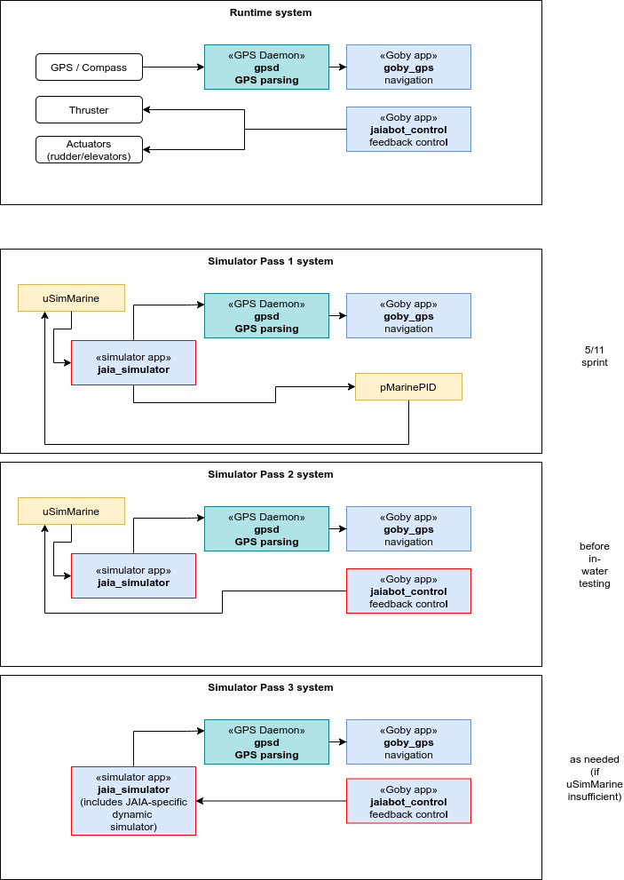
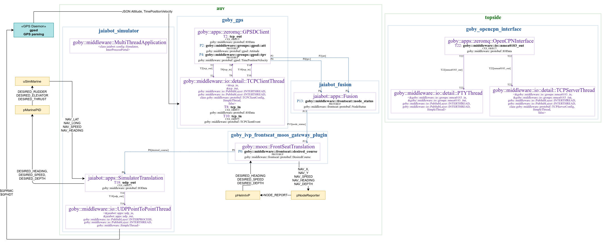

# Simulator

The `jaiabot` simulator (`jaia_simulator`) is intended to provide a full system simulation capable of faster-than-realtime simulation of the relavant software components.

Whenever possible, the simulator interfaces with the rest of the system using the same API and drivers as the actual sensors and other hardware.

Building the simulator will be an incremental process, adding additional subsystem functionality as we progress.

## Control / Nav simulator

This subsystem within the simulator provides simulated vehicle positions in a simple model ocean based on desired control inputs.

### Roadmap

We will develop this simulator in several steps, starting with the most accessible open source software and progressing to a higher-fidelity jaia-specific implementation over time.

### Pass 1 System

A more detailed diagram combined from the output of `goby_clang_tool` for the Goby3 components and hand-drawing for the non-Goby parts is given below:

