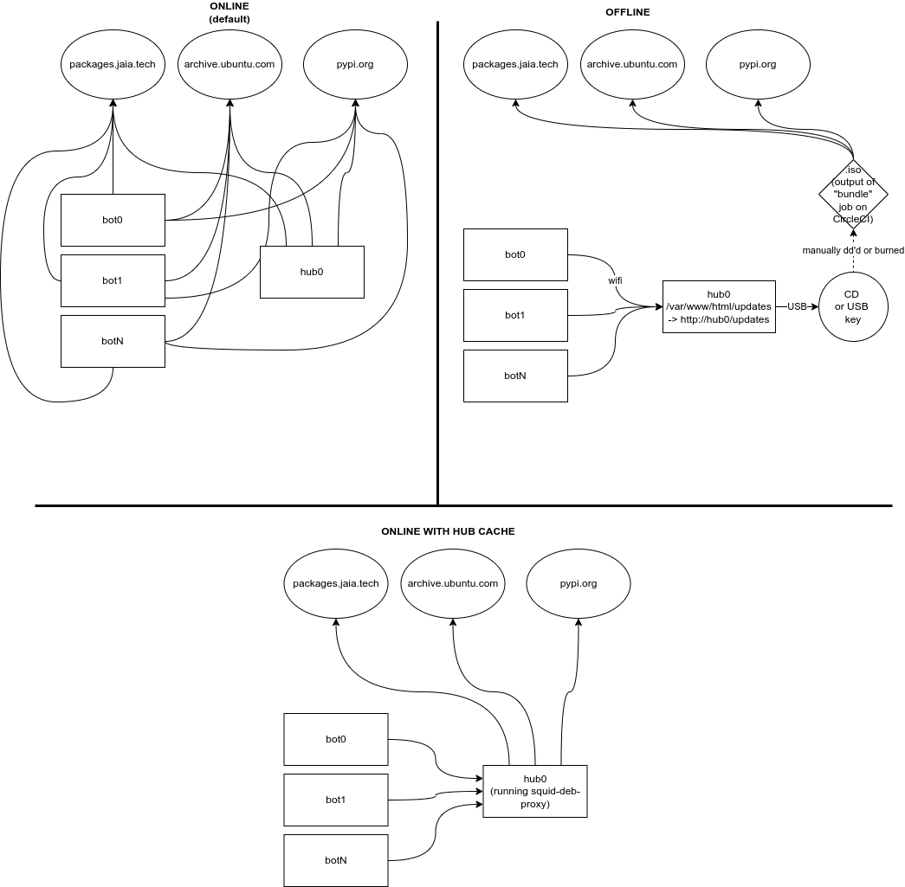

# Building and Installing JaiaBot software

JaiaBot development is done on Ubuntu Linux, with the version of Ubuntu supported aligned with the `jaiabot` release branch (see [Repository](page19_repository.md) page).

## Dependencies

The JaiaBot software depends on Goby3, MOOS, and other packages.

When using the `jaiabot` Debian packages (see the CI/CD section below), these dependencies are automatically installed by `apt`.

When building from source, these can be installed from the regular Ubuntu package repositories plus the `packages.jaia.tech` mirror of the `packages.gobysoft.org` repository (also reference the steps in jaiabot/.docker/focal/amd64/Dockerfile):

```
# add mirror of packages.gobysoft.org to your apt sources
echo "deb http://packages.jaia.tech/ubuntu/gobysoft/1.y/ `lsb_release -c -s`/" | sudo tee /etc/apt/sources.list.d/gobysoft_release.list
# install the public key for packages.gobysoft.org
sudo apt-key adv --recv-key --keyserver keyserver.ubuntu.com 19478082E2F8D3FE
# update apt
sudo apt update
# install the required dependencies
sudo apt-get -y install libgoby3:amd64 \
            libgoby3-dev:amd64 \
            libgoby3-moos-dev:amd64 \
            libgoby3-moos:amd64 \
            libgoby3-gui-dev:amd64 \
            goby3-interfaces:amd64 \
            libnanopb-dev:amd64 \
            nanopb:amd64 \
            python3-protobuf:amd64 \
            wget:amd64 \
            curl:amd64 \
            nodejs:amd64 \
            webpack:amd64 \
            npm:amd64
```

## CMake

The `jaiabot` software is configured using CMake which (by default) then generates Makefiles that the `make` tool uses to invoke the C++ compiler and linker.

This process is summarized by:

```
# make a directory for the generated objects
mkdir -p build/amd64
cd build/amd64
# configure the project
cmake ../..
# build it (using make by default)
cmake --build .
```

This project provides a convenience script called `build.sh` that runs cmake to configure and build the project (using as many jobs as your machine has processors). The build.sh script segregates the CMake working directory by machine architecture (e.g. build/amd64, build/arm64, etc.). Additionally, you can set the environmental variables `JAIABOT_CMAKE_FLAGS` and/or `JAIABOT_MAKE_FLAGS` to pass command line parameters to CMake (during configure) or make, respectively.

Some examples:

Basic build:

```
./build.sh
```

Build documentation as well:

```
export JAIABOT_CMAKE_FLAGS="-Dbuild_doc=ON"
./build.sh
```

## CI/CD

Continuous integration (CI) and continuous deployment (CD) are software best practices to ensure that code is quickly and easily integrated and tested. The CI part is managed by a standard Git workflow of committing regularly, pushing changes to Github.com, and integrating back to the `1.y` "main" branch using the pull request feature on Github.

The CD part is managed by [CircleCI](https://circleci.com/), which is a cloud-based configurable build and test system. The `.circleci/config.yml` file configures the actions ("workflow") performed by the CircleCI servers. Open source projects get [substantial free credits](https://circleci.com/open-source/) for building with CircleCI.

We use CircleCI to do two main types of builds:

- "basic" code build and run unit tests
- Debian package build to produce .deb packages that can be installed by `apt`. These are categorized to allow for a stratification of stability versus the latest features:
  - "test" builds that run when necessary to test build packages for branches before merging into `1.y`
  - "continuous" builds that are run with each commit to the `1.y` branch (usually the result of a pull request merge). This is the newest code.
  - "beta" builds that a run with each release ending in an `_` (e.g., `1.0.0_beta1`) which is changed to `~` (e.g. 1.0.0~beta1). Git does not allow `~` in tag names, hence the substitution.
  - "release" builds that are run with any other release release (`git tag`), e.g., `1.0.0`.

The interaction between the developers and the automated CI/CD system is summarized in the following figure:


### Feature development / bug fix

When the developer is working on a new feature or fixing a bug, he or she _branches_ the code into a "feature branch", then incrementally commits and pushes these changes. Each commit that is pushed triggers a basic build on CircleCI to ensure that the committed code compiles correctly and the existing unit tests pass.

### After the pull request is merged

Once the developer has completed his or her feature or bug fix, he or she puts a "pull request" up on Github to be reviewed by another member of the software team. The pull request is generally set to merge the feature branch (e.g. "my-new-feature-xyz") into the "main" branch (`1.y` in our case). After review (using the GitHub UI), the reviewer merges the pull request and this automatically triggers the CircleCI system to do a package build of the code. These packages (.deb packages for installing on Ubuntu) are pushed the **continuous** repository on packages.jaia.tech. At this point, they can be installed using `apt` onto any system with that repository installed:

```
# add mirror of packages.gobysoft.org to your apt sources
echo "deb http://packages.jaia.tech/ubuntu/gobysoft/1.y/ `lsb_release -c -s`/" | sudo tee /etc/apt/sources.list.d/gobysoft_release.list
# install the public key for packages.gobysoft.org
sudo apt-key adv --recv-key --keyserver keyserver.ubuntu.com 19478082E2F8D3FE
# add packages.jaia.tech to your apt sources
echo "deb http://packages.jaia.tech/ubuntu/continuous/1.y/ `lsb_release -c -s`/" | sudo tee /etc/apt/sources.list.d/jaiabot_release.list
# install the public key for packages.jaia.tech
sudo apt-key adv --recv-key --keyserver keyserver.ubuntu.com 954A004CD5D8CF32
sudo apt update
# install the Goby and MOOS apps
sudo apt install goby3-apps goby3-moos goby3-gui moos-ivp-apps moosdb10 libmoos-ivp
# install the jaia code
sudo apt install jaiabot-apps jaiabot-python jaiabot-config jaiabot-web
# optional: compiled Arduino sketches and upload scripts
sudo apt install jaiabot-arduino
# optional: compiled documentation to /usr/share/doc/jaiabot/html
sudo apt install jaiabot-doc
# optional: Goby clang tool interface definitions (publish/subscribe API) to /usr/share/jaiabot/interfaces
sudo apt install jaiabot-interfaces
```

### After a release is made

Once the decision has been made to release the software, a tag is made on the git repository and pushed to Github. The creation of a new tag automatically triggers a CircleCI build that is the same as the continuous build but is pushed to a different repository.

Depending on the tag structure, this may either be the `beta/1.y` or `release/1.y`. Beta releases are tagged as `x.y.z_betaN` (e.g., 1.0.5_beta3) which becomes Debian version `x.y.z~betaN` during the CircleCI build.

To use the release or beta repository, simply run the same commands as in the previous section, just substitute `http://packages.jaia.tech/ubuntu/release/1.y/` or `http://packages.jaia.tech/ubuntu/beta/1.y/`for `http://packages.jaia.tech/ubuntu/continuous/1.y/`.

It is perfectly fine to have more than one of these repositories installed at once. In all cases the newest code will be installed (so if you have both release and continuous installed, you will always get packages from continuous, or if you have release and beta installed, you will get packages from beta).

### Package tagging

Debian packages are given versions based on the git tag version (for "release" or "beta" packages) or the last tagged release plus the git hash (for "continuous" packages).

The `~` used by Debian that sorts **before** any other versions is not allowed as a symbol in git tags, so we substitute `_` instead. For example `git tag 1.0.0_beta1` becomes Debian version `1.0.0~beta1` which is treated as an earlier version than `1.0.0`.

Additionally the Ubuntu version that the package is build for is appended to the version name as `~ubuntuXX.YY.Z`

Examples:

- `git tag 1.0.0` built on Ubuntu 20.04 "focal" becomes Debian version `1.0.0-0~ubuntu20.04.1`
- git hash 8f9b675, which is 5 commits after `git tag 1.0.0_alpha1` built on Ubuntu 18.04 "xenial" becomes Debian version `1.0.0~alpha1+5+g8f9b675-0~ubuntu18.04.1`

This scheme ensures that continuous packages are considered to always be newer versions (by the rules of `apt`) than the last (beta or regular) release. This also ensures that each version can be tracked back to the git tag or git hash from which it was built.

## Initial set up of packages.jaia.tech

This section describes the process by which the [packages.jaia.tech](http://packages.jaia.tech/) VM was initially configured, in the event that it needs to be re-created, or modified.

### Creation of VM

packages.jaia.tech is hosted on AWS as an EC2 virtual machine with Ubuntu 22.04 EC2 using the t3a.micro instance type and a 30 GB SSD.

The default user (`ubuntu`) is configured with the appropriate SSH keys for general access.

A secondary unprivileged (no sudo) user was created for the `dput` uploads. This user is only configured for login with the `id_packages_ssh` public SSH key (private key is set in CircleCI):

```
sudo adduser dput
```

### Dependencies

```
sudo apt install emacs mini-dinstall apache2 gpg
```

### Configuration

`mini-dinstall` manages the actual Debian repository on packages.jaia.tech. `dput` uploads packages (from CircleCI). For integrity reasons, packages are signed after building using a known GPG key (which is verified when you do an `apt install ...`). This is done by the `sign_release.sh` script.

I copied these files (`mini-dinstall.conf` and `sign_release.sh` from `jaiabot/scripts/packages` to `/opt/jaia_packages` on packages.jaia.tech).

As the repositories are hosted using HTTP via Apache2, I created the empty repository directories and made `dput` the user:

```
sudo mkdir -p /var/www/html/ubuntu/continuous/1.y/mini-dinstall/incoming
sudo mkdir -p /var/www/html/ubuntu/beta/1.y/mini-dinstall/incoming
sudo mkdir -p /var/www/html/ubuntu/release/1.y/mini-dinstall/incoming
sudo chown -R dput /var/www/html/ubuntu/
```

### SSH for dput

In order to upload packages, CircleCI needs to be able to SSH to packages.jaia.tech. For this reason, I created a dedicated SSH key pair (written to `id_packages_ssh` / `id_packages_ssh.pub`):

```
ssh-keygen -t ed25519
```

I added the `id_packages_ssh.pub` to /home/dput/.ssh/authorized_keys and the private key (`id_packages_ssh`) to [the appropriate CircleCI setting](https://app.circleci.com/settings/project/github/jaiarobotics/jaiabot/ssh).

### dput configuration

The configuration for `dput` is in `jaiabot/.circleci/dput.cf`. It is configured for each of the existing three repositories: `jaiabot-continuous-1.y` for `/var/www/html/ubuntu/continuous/1.y`, `jaiabot-beta-1.y` for `/var/www/html/ubuntu/beta/1.y` and `jaiabot-release-1.y` for `/var/www/html/ubuntu/release/1.y`.

### GPG for signing

I created a GPG key for signing (as `dput` user):

```
sudo su dput
gpg --gen-key

Real name: Jaiabot Packages
Email address: info@jaia.tech
```

and the fingerprint of the resulting (public) key was `954A004CD5D8CF32`.

In order for CircleCI builds to sign the package, the GPG private key must be available to CircleCI but kept private (so it can't be in `jaiabot`):

```
gpg -a --export-secret-keys 954A004CD5D8CF32 | cat -e | sed 's/\$/\\n/g'
```

The resulting contents was copied into Circle CI [private environmental variable configuration](https://app.circleci.com/settings/project/github/jaiarobotics/jaiabot/environment-variables) and called "GPG_KEY" (which is later used by `jaiabot/.circleci/config.yml`).

### packages.gobysoft.org mirror

To control the version of the GobySoft packages used, we maintain a mirror of packages.gobysoft.org (for each release series: 1.y, 2.y, etc. and two release levels: "release" and "staging") that can be manually updated as necessary using the `update_gobysoft_mirror.sh` script.

#### Create/update the mirror

Two GobySoft mirrors are provided ("release" and "staging") so that new updates to GobySoft packages can be progressively tested and merged into the JaiaBot repository.

The script `update_gobysoft_mirror.sh` in `jaiabot/scripts/packages` (copied to `/opt/jaia_packages` on packages.jaia.tech) can be used to interactively manage the state of the GobySoft mirrors and their relation to the Jaiabot release distributions.

The script has three actions:

- "Update Staging Mirror": Use `apt-mirror` to pull the latest packages.gobysoft.org packages into the staging mirror (`/var/spool/apt-mirror/staging/${branch}` where `${branch}` is one of 1.y, 2.y, etc.). This will also prompt for "Choose Staging and Release Repositories" after completion of apt-mirror.
- "Update Release Mirror from Staging": Copy the staging mirror to the release mirror (`/var/spool/apt-mirror/release/${branch}`) and set all repositories to point to this release mirror.
- "Choose Staging and Release Repositories": Choice which repositories (from "test", "continuous", "beta" and "release") should point to the staging mirror, and the rest will be set to the release mirror. This is done by symlinking from `/var/spool/apt-mirror/[staging|release]/${branch}/mirror/packages.gobysoft.org/ubuntu/release` to `/var/www/html/ubuntu/gobysoft/[test|continuous|beta|release]/${branch}`.

(For backwards compatibility, `/var/www/html/ubuntu/gobysoft/1.y` is manually symlinked to `/var/www/html/ubuntu/gobysoft/release/1.y`)

#### Pulling in a new Goby release

The general process for pulling in a new Goby release should be:

- Run `update_gobysoft_mirror.sh` and choose "Update Staging Mirror". Then select "test" and "continuous" for the repos to link to staging (do not select "beta" yet; "beta" (and "release") will continue to use the old GobySoft "release" repo).
- Merge the changes in jaiabot that need the updated Goby release into 1.y which will trigger a CircleCI "continuous" build against the new Goby release in the staging repository.
- Test on vehicles using the continuous `jaiabot.list` repos:

```
deb http://packages.jaia.tech/ubuntu/continuous/1.y/ @DISTRIBUTION@/
deb http://packages.jaia.tech/ubuntu/gobysoft/continuous/1.y/ @DISTRIBUTION@/
```

- When ready to release a beta tag, just before tagging, run `update_gobysoft_mirror.sh` and choose "Choose Staging and Release Repositories", selecting "test", "continuous", and "beta" as the repos to link to staging.
- Tag `jaiabot` with the beta tag and push. This will trigger a CircleCI "beta" build against the staging repo.
- Test on vehicles using the beta `jaiabot.list` repos:

```
deb http://packages.jaia.tech/ubuntu/beta/1.y/ @DISTRIBUTION@/
deb http://packages.jaia.tech/ubuntu/gobysoft/beta/1.y/ @DISTRIBUTION@/
```

- When ready to make the final release, just before tagging, run `update_gobysoft_mirror.sh` and choose "Update Release Mirror from Staging". This will copy the staging mirror in to the release mirror and point all the repos to the release mirror.
- Tag `jaiabot` with the release tag and push. This will trigger a CircleCI "release" build against the (newly updated) release repo.

## Alternative Debian package update options

The default update path assumes a reasonably fast internet connection to the public Ubuntu repositories and packages.jaia.tech. This is not always the case, so two alternative update pathways are provided:

- online with hub caching (bots/hubs have a slow or metered internet connection)
- offline (bots/hub that are never internet connected)



The Ansible playbook `jaiabot/config/ansible/change-sources.yml` can be used to change the update mode for a given fleet (this can also be run with the Liaison pre-launch UI with role == ADVANCED or higher).

### Online updates with Hub Caching

Update many bots at once can place high demands on the internet connection as they all have to fetch the same .deb packages. To reduce this load, we can configure the hub to act as a caching proxy using the `squid-deb-proxy` package. In this case, the hub will cache any packages requested so that future requests are served locally by the hub rather than requiring another internet download.

To enable online mode with hub caching:

```
ansible-playbook  -i /etc/jaiabot/inventory.yml change-sources.yml -e mode=online_with_hub_cache -e version=1.y -e repo=release
```

### Offline updates

For some scenarios, the fleet must be updated without connecting it to the internet. For this reason, each CircleCI build of Debian packages also creates an `.iso` (CD image) that contains the `jaiabot-embedded` Debian package and all its dependencies (recursively, based of the base ubuntu Docker image). Additionally it includes the required Python wheels used by pip when installing `jaiabot-python`.

This `.iso` is then burned to a CD or `dd`'d to a USB key and connected to `hub0` of the fleet. The `/etc/fstab` will already include the mount point (based off the ISO label: `updates`), so simply running `sudo mount -a` or rebooting the hub will mount this disk to `/var/www/html/updates` (which is served by Apache2 as http://hub0/updates).

To enable offline mode:

```
ansible-playbook  -i /etc/jaiabot/inventory.yml change-sources.yml -e mode=offline
```

At this point each bot and hub in the fleet can be updated by simply running `sudo apt update && sudo apt dist-upgrade`, exactly as if it was connected to the internet.

**Please keep in mind that the offline updates do not include the usual Ubuntu security patches so are not suitable for internet-connected machines (use the Online or Online update with Hub Caching in this case to ensure security updates are installed).**

### Online (default mode)

To revert to "normal" online updates after using one of the alternatives (or to switch the repo or version), you can use the same playbook:

```
ansible-playbook  -i /etc/jaiabot/inventory.yml change-sources.yml -e mode=online -e repo=release -e version=1.y
```

## Cross-compiling locally using Docker

**This process is being deprecated in favor of using the continuous Debian packages described above.** However, it still may be useful in some scenarios.

For rapid turnaround development where it is infeasible to wait for the CI/CD packages to complete, we can cross-compile for the `jaiabot` code for the ARM64 target (Raspberry Pi) using a Docker container that holds all the appropriate dependencies:

### Install Docker

```
# Update the apt package index and install packages to allow apt to use a repository over HTTPS:
sudo apt-get update
sudo apt-get install apt-transport-https ca-certificates curl gnupg lsb-release
# Add Docker’s official GPG key:
curl -fsSL https://download.docker.com/linux/ubuntu/gpg | sudo gpg --dearmor -o /usr/share/keyrings/docker-archive-keyring.gpg
# Use the following command to set up the stable repository.
echo \
  "deb [arch=amd64 signed-by=/usr/share/keyrings/docker-archive-keyring.gpg] https://download.docker.com/linux/ubuntu \
  $(lsb_release -cs) stable" | sudo tee /etc/apt/sources.list.d/docker.list > /dev/null
# Update the apt package index, and install the latest version of Docker Engine and containerd
sudo apt-get update
sudo apt-get install docker-ce docker-ce-cli containerd.io
# Create the docker group and add your user.
sudo usermod -aG docker $USER
newgrp docker
# Verify that you can run docker commands without sudo.
docker run hello-world
# Configure Docker to start on boot
sudo systemctl enable docker.service
sudo systemctl enable containerd.service
```

### Build the image

To create the docker image initially (should only need to be done initially and whenever there are updates to the dependencies):

```bash
cd jaiabot/.docker/focal/arm64
docker build -t gobysoft/jaiabot-ubuntu-arm64:20.04.1 .
# optionally, push to docker hub
docker push gobysoft/jaiabot-ubuntu-arm64:20.04.1
```

### Cross-compile in the container

Then to cross-compile using this image:

```bash
cd jaiabot
# run the docker container interactively
docker run -v `pwd`:/home/ubuntu/jaiabot -w /home/ubuntu/jaiabot -it gobysoft/jaiabot-ubuntu-arm64:20.04.1
# update any dependencies since the image was created (not required if you've recently built the image)
apt update && apt upgrade -y
# actually build the code
./scripts/arm64_build.sh
```

### Copy the binaries to the Raspberry Pi

If you rsync the contents of `jaiabot/build/bin` and `jaiabot/build/lib` to the Raspberry Pi at `/home/ubuntu/jaiabot` you should be able to run them successfully.

(This assumes that `/home/ubuntu/jaiabot/build` exists on the Raspberry Pi, if not, `mkdir` it first):

```
cd jaiabot
rsync -aP build/bin build/lib ubuntu@172.20.11.10:/home/ubuntu/jaiabot/build
```

### Build and copy in one step

Use the all-in-one-script (`/scripts/docker_arm64_build-and-deploy.sh`):

```
##
## Usage:
## jaiabot_arduino_type=usb_old jaiabot_systemd_type=bot ./docker-arm64-build-and-deploy.sh 172.20.11.102
##
## Command line arguments is a list of Jaiabots to push deployed code to.
## If omitted, the code is just built, but not pushed
## Env var "jaiabot_arduino_type" can be set to one of: usb, spi, which will upload the ardui
no code (jaiabot_runtime) based on the connection type. If unset, the arduino code will not be flashed.
## Env var "jaiabot_systemd_type" can be set to one of: bot, hub, which will generate and enable the appr
opriate systemd services. If unset, the systemd services will not be installed and enabled
##
```
