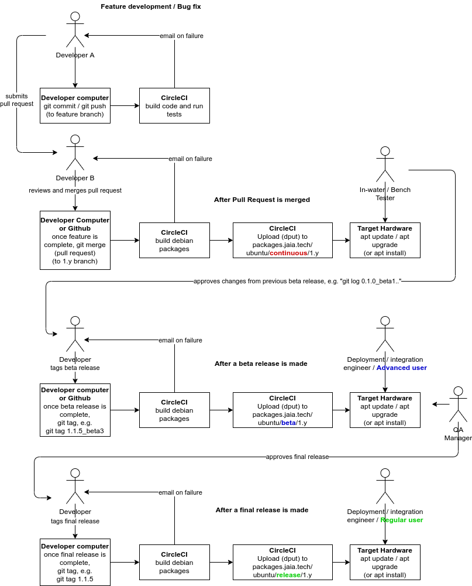

# Building JaiaBot software

JaiaBot development is done on Ubuntu Linux, generally the latest LTS version.

## Dependencies

The JaiaBot software depends on Goby3, MOOS, and other packages. These can be installed from the regular Ubuntu package repositories plus the packages.gobysoft.org repository:

```
# add packages.gobysoft.org to your apt sources
echo "deb http://packages.gobysoft.org/ubuntu/release/ `lsb_release -c -s`/" | sudo tee /etc/apt/sources.list.d/gobysoft_release.list
# install the public key for packages.gobysoft.org
sudo apt-key adv --recv-key --keyserver keyserver.ubuntu.com 19478082E2F8D3FE
# update apt
sudo apt update
# install the required dependencies
sudo apt install libgoby3-dev libgoby3-moos-dev libgoby3-gui-dev gpsd libnanopb-dev nanopb python3-protobuf
```

## CMake

The `jaiabot` software is configured using CMake which (by default) then generates Makefiles that the `make` tool uses to invoke the C++ compiler and linker.

This process is summarized by:

```
# make a directory for the generated objects
mkdir build
cd build
# configure the project
cmake ..
# build it (using make by default)
cmake --build .
```

This project provides a convenience script called `build.sh` that runs cmake to configure and build the project (using as many jobs as your machine has processors). Additionally, you can set the environmental variables `JAIABOT_CMAKE_FLAGS` and/or `JAIABOT_MAKE_FLAGS` to pass command line parameters to CMake (during configure) or make, respectively.

Some examples:

Basic build:
```
./build.sh
```

Build documentation as well:
```
export JAIABOT_CMAKE_FLAGS="-Dbuild_doc=ON"
./build.sh
```

## CI/CD

Continuous integration (CI) and continuous deployment (CD) are software best practices to ensure that code is quickly and easily integrated and tested. The CI part is managed by a standard Git workflow of committing regularly, pushing changes to Github.com, and integrating back to the `1.y` "master" branch using the pull request feature on Github.

The CD part is managed by [CircleCI](https://circleci.com/), which is a cloud-based configurable build and test system. The `.circleci/config.yml` file configures the actions ("workflow") performed by the CircleCI servers. Open source projects get four parallel free build servers from CircleCI.

We use CircleCI to do two main types of builds:

- "basic" code build and run unit tests
- Debian package build to produce .deb packages that can be installed by `apt`
    - "continuous" builds that are run with each commit to the `1.y` branch (usually the result of a pull request merge).
    - "release" builds that are run with each release (`git tag`)


The interaction between the developers and the automated CI/CD system is summarized in the following figure:



### Feature development / bug fix

When the developer is working on a new feature or fixing a bug, he or she *branches* the code into a "feature branch", then incrementally commits and pushes these changes. Each commit that is pushed triggers a basic build on CircleCI to ensure that the committed code compiles correctly and the existing unit tests pass.

### After the pull request is merged

Once the developer has completed his or her feature or bug fix, he or she puts a "pull request" up on Github to be reviewed by another member of the software team. The pull request is generally set to merge the feature branch (e.g. "my-new-feature-xyz") into the "master" branch (`1.y` in our case). After review (using the Github UI), the reviewer merges the pull request and this automatically triggers the CircleCI system to do a package build of the code. These packages (.deb packages for installing on Ubuntu) are pushed the **continuous** repository on packages.gobysoft.org. At this point, they can be installed using `apt` onto any system with that repository installed:

```
# add packages.gobysoft.org to your apt sources
echo "deb http://packages.gobysoft.org/ubuntu/continuous/ `lsb_release -c -s`/" | sudo tee /etc/apt/sources.list.d/gobysoft_continuous.list
# install the public key for packages.gobysoft.org
sudo apt-key adv --recv-key --keyserver keyserver.ubuntu.com 19478082E2F8D3FE
sudo apt update
# install the jaia code
sudo apt install jaiabot-apps
# optional: compiled documentation to /usr/share/doc/jaiabot/html
sudo apt install jaiabot-doc
# optional: Goby clang tool interface definitions (publish/subscribe API) to /usr/share/jaiabot/interfaces
sudo apt install jaiabot-interfaces
```

### After a release is made

Once the decision has been made to release the software, a tag is made on the git repository and pushed to Github. The creation of a new tag automatically triggers a CircleCI build that is the same as the continuous build but is pushed to a different repository:

To use the release repository, run these commands:
```
# add packages.gobysoft.org to your apt sources
echo "deb http://packages.gobysoft.org/ubuntu/release/ `lsb_release -c -s`/" | sudo tee /etc/apt/sources.list.d/gobysoft_release.list
# install the public key for packages.gobysoft.org
sudo apt-key adv --recv-key --keyserver keyserver.ubuntu.com 19478082E2F8D3FE
sudo apt update
# install jaia packages as needed...
```

### Package tagging

Debian packages are given versions based on the git tag version (for "release" packages) or the last tagged release plus the git hash (for "continuous" packages).

The `~` used by Debian that sorts **before** any other versions is not allowed as a symbol in git tags, so we substitute `_` instead. For example `git tag 1.0.0_beta1` becomes Debian version `1.0.0~beta1` which is treated as an earlier version than `1.0.0`.

Additionally the Ubuntu version that the package is build for is appended to the version name as `~ubuntuXX.YY.Z`

Examples:

- `git tag 1.0.0` built on Ubuntu 20.04 "focal" becomes Debian version `1.0.0-0~ubuntu20.04.1`
- git hash 8f9b675, which is 5 commits after `git tag 1.0.0_alpha1` built on Ubuntu 18.04 "xenial" becomes Debian version `1.0.0~alpha1+5+g8f9b675-0~ubuntu18.04.1`

This scheme ensures that continuous packages are considered to always be newer versions (by the rules of `apt`) than the last release. This also ensures that each version can be tracked back to the git tag or git hash from which it was built.


