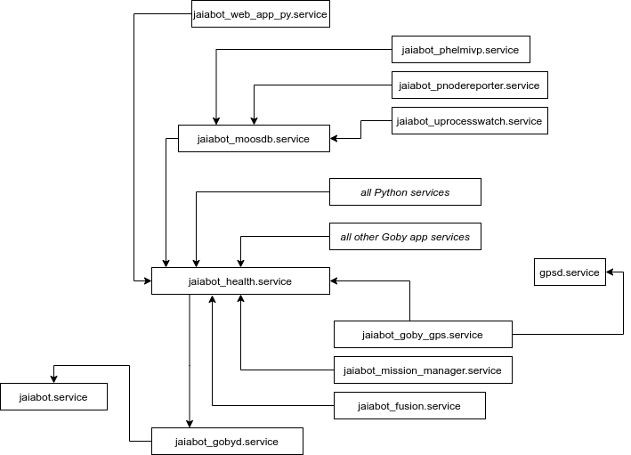

# Embedded Board Deployment

JaiaBot uses the Raspberry Pi (RP) Compute Module 4 (CM4) as the embedded Linux computer. For R&D purposes, it has also been necessary to run the jaiabot software on a Raspberry Pi 3 although this is not ideal due to the port mappings being different from the RP4.

## Setup steps (new RP CM4)

### Flashing the bootloader configuration

*Note: this step should only need to be done once per new CM4.*

The RP bootloader on older CM4 boards does not boot from all the USB ports automatically. Thus, we need to update the bootloader configuration once on each CM4 that we receive in order to ensure that the CM4 will boot from the USB thumb drive.

- Once, to set up your developer machine (e.g. Ubuntu computer), follow the steps to [build the usbboot repository](https://www.raspberrypi.com/documentation/computers/compute-module.html#compute-module-4-bootloader). At the time of writing, this repository was at [commit 70b14a](https://github.com/raspberrypi/usbboot/commit/70b14a2a4fdad7caf7a614d299cb6f6b1c1b3f56).
- For each CM4, follow the steps to
	1. [setup the CMIO board](https://www.raspberrypi.com/documentation/computers/compute-module.html#setting-up-the-cmio-board) J2 jumper and micro USB cable.
	2. [update the CM4 bootloader](https://www.raspberrypi.com/documentation/computers/compute-module.html#cm4bootloader). When editing the `boot.conf` file, check that the `BOOT_ORDER` line is set to `BOOT_ORDER=0xf25641`. For more detail on reading the value, see the [BOOT_ORDER documentation](https://www.raspberrypi.com/documentation/computers/raspberry-pi.html#BOOT_ORDER). Older CM4s were omitting the 0x5 value (which corresponds to the USB-A port on the CM4 IO board).
		- In the last step (`../rpiboot -d . `), I had to use `sudo ../rpiboot -d .`
		- After running that step (`sudo ../rpiboot -d . `), power on the CM4 IO board. The script should detect the board at this point and upload the configuration changes. It will provide some verbose output to this effect.


### Generation of the filesystem image

*Note: this step should only need to be done once per change to jaiabot-rootfs-gen (and then reused for any number of USB thumb drives).*

The [jaiabot-rootfs-gen](https://github.com/jaiarobotics/jaiabot-rootfs-gen) project is designed to generate a complete filesystem suitable to boot the RP off a USB thumb drive or other USB disk.

To generate the image, follow the steps in https://github.com/jaiarobotics/jaiabot-rootfs-gen/blob/master/README.md

The result will be something like `jaiabot_img-1.0.0~alpha1+5+g90e72a3.img`.

### Installation of the filesystem image

- Install the filesystem image via command line (or use something like balenaEtcher https://www.balena.io/etcher/):

      # assuming USB thumb drive is on /dev/sdd
      sudo dd if=jaiabot_img-1.0.0~alpha1+5+g90e72a3.img of=/dev/sdd bs=1M status=progress

- If you have access to a LAN connection to the internet (DHCP) do so and power up the Pi. You will need to find the ip address from your router. Otherwise, connect a keyboard and monitor.

- ssh or login as `jaia` / `jaia` and follow the prompts to configure the new system.

## Systemd

We use `systemd` to launch the jaiabot services on the embedded system, just as any other Ubuntu daemon.

Each application has a service definition, and they are all set to `BindTo` the `jaia.service` which exists to provide a common service that can be `stop`ped or `start`ed, thereby stopping or starting all the bound services.

### Quick start

When using the `jaiabot-embedded` Debian package, the systemd services are automatically installed to `/etc/systemd/system` and enabled. No further action is required in this case.

When using a built-from-source version of jaiabot, ensure that the local bin directory is on your `$PATH` (e.g., check that `which jaiabot_mission_manager` returns the correct binary), then run:

Bot 0 (install and enable):
```
cd jaiabot/config/gen
./systemd-local.sh bot --bot_index 0 --n_bots 4 --enable
```

Hub (install and enable):
```
cd jaiabot/config/gen
./systemd-local.sh hub --n_bots 4 --enable
```

See `./systemd-local.sh --help` for more options.

### Design

The systemd services are all controlled by a single `jaiabot.service` which doesn't do anything itself, but serves as a single point from which all the other services can be stopped, started, etc.

Then, `jaiabot_gobyd` and `jaiabot_moosdb` are bound to `jaiabot` and start their respective middleware's broker (`gobyd` and `MOOSDB`). From there, all the client services are bound to the respective broker's service. This ensures that no Goby apps are started before `gobyd` and no MOOS apps are started before `MOOSDB`. The Python apps are also bound to `jaiabot_gobyd` at the moment since they are used exclusively by the Goby driver applications. If this changes, these services can be updated.



The `jaiabot.service` waits for the system clock to be synchronized via NTP (via the GPS using `gpsd`) or until 120 seconds has elapsed.

### Generation

The systemd service files are generated via templates much like the application configuration.

The generation script lives in: `jaiabot/config/gen/systemd.py` and can be run to install systemd service jobs for either a locally built copy of jaiabot or used during the Debian package build.

To see all the options for configuring this script, run `systemd.py --help`

For a locally built copy, you can use the `systemd-local.sh` shell script (a thin wrapper around `systemd.py` that executes `systemd.py` using the current interactive shell settings, such as `$PATH`).

This script will generally have the correct defaults for the various directories, assuming that the version of the `jaiabot` apps and the Goby applications (`gobyd`, etc.) that you wish to run are currently set correctly in the shell `$PATH` environmental variable at the time of running the `gen/systemd-local.sh` generation script.

Running `./systemd-local.sh --help` will always show the defaults inferred from the `$PATH` for all the directories (`--jaiabot_bin_dir`, `--jaiabot_share_dir`, etc.)

### Usage

- To start, stop, or restart all the JaiaBot applications:
	```
	sudo systemctl start jaiabot
	```
	```
	sudo systemctl stop jaiabot
	```
	```
	sudo systemctl restart jaiabot
	```
	
- To start (or stop, restart) a single application:
	```
	sudo systemctl start jaiabot_control_surfaces_driver
	```	
- To get a quick summary of all the applications' status:
	```
	systemctl list-units "jaiabot*"
	```
- To get the full log from a particular service (stdout/stderr),
	```
	sudo journalctl -u jaiabot_control_surfaces_driver
	```
- To get a summary and the last few lines of the log,
	```
	sudo systemctl status jaiabot_control_surfaces_driver
	```
	

## Testing with Vagrant

[Vagrant](https://www.vagrantup.com) is a useful tool for creating and managing full virtual machines (VMs), which allows us to quickly spin up and delete standard amd64 VMs for deployment testing (such as `systemd` or package testing before deployment to the actual Raspberry Pi hardware).

### Install

```
sudo apt install vagrant
```

### Initialize machine

```
vagrant init ubuntu/focal64
```

This generates a `Vagrantfile` in the current working directory, which can be modified to fit our needs. For example, to create a VM for [Virtualbox](https://www.virtualbox.org/) with 8 CPUs and 1GB memory, we can uncomment and edit this block from the `Vagrantfile`:

```
  config.vm.provider "virtualbox" do |vb|
     # Display the VirtualBox GUI when booting the machine
     vb.gui = false
     vb.cpus = 8
     # Customize the amount of memory on the VM:
     vb.memory = "1024"
  end
```

###  Start machine

To start the machine from the directory with the `Vagrantfile`, simply run
```
vagrant up
```

To ssh in, run

```
vagrant ssh
```

### Other commands

To destroy the VM, use `vagrant destroy`.
