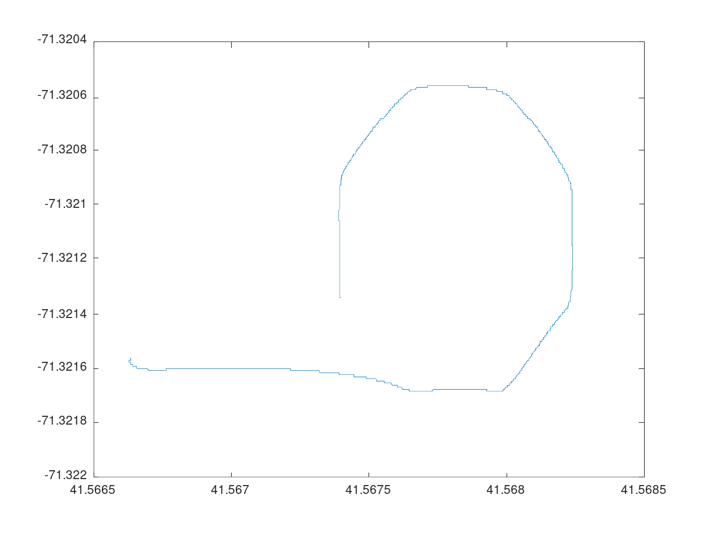

# Logging
On-board logging is performed using the `goby_logger` application, which logs every message published on the Goby3 interprocess layer to a binary `.goby` log file.

This log file can be converted in post-processing to several formats for use by data processing tools.

## Log generation
When `goby_logger ` is run (e.g. in simulation using the auv.launch script in `jaiabot-configuration`, see [Configuration](page30_configuration.md)), it writes a file (e.g. `auv0_29971128T082058.goby`) to the log directory (`/tmp/jaia-logs/bot/0` in the simulator for bot0, where `/tmp/jaia-logs` can be changed in the preseed.goby in `jaiabot-configuration`).

## Log processing
After the mission is complete, the `.goby` log can be copied off the vehicle (e.g. using rsync) and processed.

### Debug text log
The Goby log can be converted into a text file version of all the publications (for visual inspection and debugging) using

```
goby_log_tool --input_file bot0_29971128T082058.goby --format DEBUG_TEXT
```

which writes `bot0_29971128T082058.txt` by default (override by setting `--output_file`). This file can be inspected by any standard text viewer or editor.

### HDF5 file
An [HDF5](https://www.hdfgroup.org/solutions/hdf5/) file suitable for use in MATLAB, Octave, etc. can be generated using:

```
goby_log_tool --input_file bot0_29971128T082058.goby --format HDF5
```

which writes `bot0_29971128T082058.h5` by default (also can be overridden by setting `--output_file`).

#### Octave example

The HDF5 file can be read into Octave using:

```
octave --eval 'load /tmp/jaia-logs/bot/0/bot0_29971128T082058.h5' --persist
octave:1> who
Variables in the current scope:

goby__middleware__frontseat__desired_course  goby__terminate__response
goby__middleware__frontseat__helm_state      goby__terminate__result
goby__middleware__frontseat__node_status     goby__zeromq___internal_manager_request
goby__middleware__groups__gpsd__att          goby__zeromq___internal_manager_response
goby__middleware__groups__gpsd__tpv          udp_in
goby__terminate__request
```

All the HDF5 data are loaded using the group name followed by the Protobuf type name, followed by the fields (with reserved characters `:`, `.`, etc. turned into `_`), e.g.:

```
goby__middleware__frontseat__node_status.goby_middleware_frontseat_protobuf_NodeStatus.speed.over_ground
```

is the HDF5 format for:

* Goby group: goby::middleware::frontseat::node_status
* (Protobuf) type: goby.middleware.frontseat.protobuf.NodeStatus
* (Protobuf) field: speed [Message]
    * over_ground [double]

This simple `.m` file will plot the vehicle's position in latitude/longitude for the entire mission:

```
load /tmp/jaia-logs/bot/0/bot0_29971128T082058.h5
node_status = goby__middleware__frontseat__node_status.goby_middleware_frontseat_protobuf_NodeStatus;
plot(node_status.global_fix.lat, node_status.global_fix.lon);
```

(which produces for a simple octagon mission):
