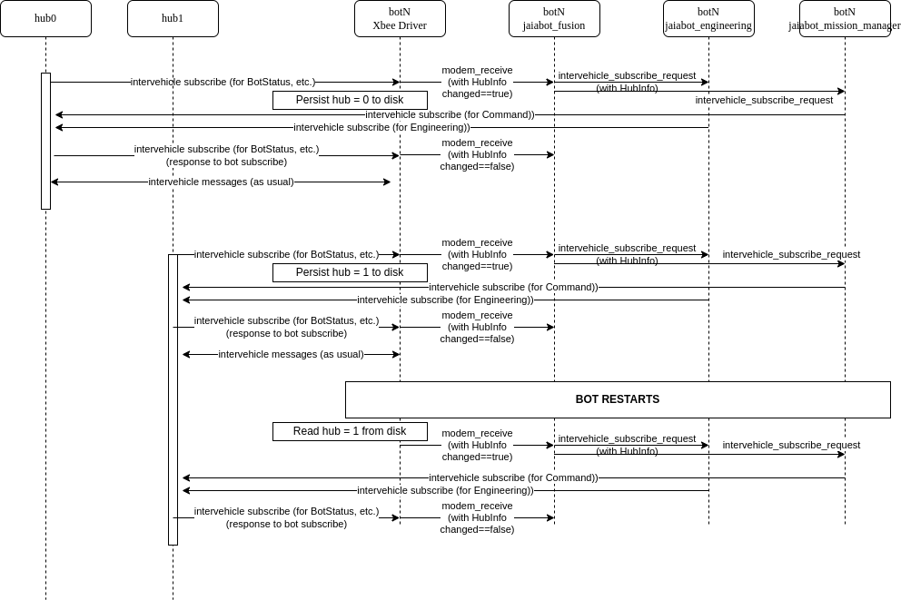

# Communications

The Jaia bots and hubs communicate using two types of wireless radio:

- 802.11 Wifi (Internet Protocol)
- XBee radio (XBP9X-DMUS-001 or XBP9B-DMSTB002)

During real (as opposed to simulated) operations the XBee radio is used for all hub to bot operational communications (BotStatus, Command, etc.). The Wifi link is only used for data offload. During simulated operations the (simulated) Wifi link is used for all communications (no XBee simulator has been implemented).

Bot to Hub communications (and vice-versa) is based on the [intervehicle layer](https://goby.software/3.0/md_doc210_transporter.html#autotoc_md57) of the Goby3 middleware. This is a publish/subscribe model, with explicit messages sent to initiate actual communications over the radio link  (subscription forwarding).

Each physical radio is interfaced with using a driver implemented from `goby::acomms::ModemDriverBase`. The XBee driver is in the `jaiabot` repository in the `src/lib/comms/xbee` directory. The UDPDriver from Goby3 is used for Wifi communications (during simulation). Data offload is not sent via Goby3 but rather  uses `rsync` over SSH.

## XBee

The XBee radios (Digi XBee-PRO 900HP S3B Radio) have two operating modes. They can act as wireless serial ports in their default "transparent" mode, or they can act as packet-based radios in their "API" mode. The Jaia XBee driver uses the radios in the "API" mode which uses a combination of AT commands (Hayes radio) and Digi API (binary) commands over serial.

See this document for documentation on the XBee radio and its software interface:

- <https://www.digi.com/resources/documentation/Digidocs/90002173>

### Software components

The XBee driver is comprised of two main components:

- `jaiabot::comms::XBeeDriver` which implements `goby::acomms::ModemDriverBase`
- `jaiabot::comms::XBeeDevice` which talks directly to the serial device and XBee radio. Each `XBeeDriver` contains an `XBeeDevice`.

### XBeeDriver Configuration

The XBee driver takes the following configuration (within `gobyd`'s configuration) as an extension to the `goby.acomms.protobuf.DriverConfig` Protobuf message (see `jaiabot/src/lib/messages/xbee_extensions.proto`):

```
   driver_cfg {
      driver_name: "xbee_driver" # fixed
      serial_port: "/dev/xbee" # set to Xbee serial port
      serial_baud: 9600
      modem_id: N # the current modem id
      ...
      [xbee.protobuf.config] {  #  (optional)
        network_id: 7  # Network ID for this fleet (must match 
                       # other peers in fleet): sets Xbee 
                       # ATID=network_id (optional) (default=7)
        peers {  # Mapping of Xbee serial_number to hub/bot id 
                 # for all peers in the fleet (repeated)
          node_id: ""  # DEPRECATED (use hub_id or bot_id): set 
                       # peer modem id as string (optional)
          hub_id:   # Hub ID number for this peer (if peer is 
                    # hub) (optional)
          bot_id:   # Bot ID number for this peer (if peer is 
                    # bot) (optional)
          serial_number:   # XBee serial number for this peer 
                           # (determined by querying ATSH and ATSL) 
                           # (required)
        }
        test_comms: false  # If true, enables testing 
                           # functionality and diagnostics 
                           # (optional) (default=false)
        xbee_info_location: "/etc/jaiabot/xbee_info.pb.cfg"  
                                              # Location to write 
                                              # a file with serial 
                                              # number and node id 
                                              # to be used by 
                                              # jaiabot_metadata 
                                              # (optional) 
                                              # (default="/etc/jaiab
                                              # ot/xbee_info.pb.cfg"
                                              # )
        hub_id:   # If this node is a hub, set its hub_id here. 
                  # (optional)
        use_xbee_encryption: false # This is used to determine if we should enable AES-128 encryption.
                                   # If true, then all systems will need to use encryption.
                                   # Advanced Encryption Standard (AES-128)
                                   # (optional) (default=false)
        xbee_encryption_password: "" # This is used for the encryption password. 
                                     # Password is a 128 bit value (16 bytes)
                                     # (optional) (default = "") 
      }
    }
```


The `peers` table must match for all bots and hubs in a particular fleet, and is required since the XBee serial numbers are factory set and cannot be changed.
The `encryption` settings must match as well for the fleet.

An example configuration for hub 1 in a two bot/two hub fleet is:

```
    driver { 
        driver_name: "xbee_driver"
        serial_port: "/dev/xbee"
        serial_baud: 9600
        modem_id: 1
        [xbee.protobuf.config] {
            network_id: 0
            peers {
                hub_id: 0
                serial_number: 0x13A200421F31C3
            }
            peers {
                hub_id: 1
                serial_number: 0x13A200421F6C51
            }
            peers {
                bot_id: 0
                serial_number: 0x13A200421F6BC2
            }
            peers {
                bot_id: 1
                serial_number: 0x13A200421F6B7A
            }
            hub_id: 1
            use_xbee_encryption: false 
            xbee_encryption_password: "" 
        }
    }
```

and for bot 0 in the same fleet:

```
    driver { 
        driver_name: "xbee_driver"
        serial_port: "/dev/xbee"
        serial_baud: 9600
        modem_id: 2
        [xbee.protobuf.config] {
            network_id: 0
            peers {
              ... // same as for hub 1
            }
            use_xbee_encryption: false 
            xbee_encryption_password: "" 
        }
    }
```

### XBeeDriver Wire protocol

The XBeeDriver converts the required parts of `goby::acomms::protobuf::ModemTransmission` (with a single data frame, max_frame_size = 1) into the `xbee::protobuf::XBeePacket` Protobuf/DCCL message and encodes it using [DCCL](https://libdccl.org) (but removes the 2 ID bytes as these are unnecessary as the XBeePacket is the only message sent on the XBee link). This resulting encoded DCCL message (minus the first 2 bytes) is sent as the payload of the XBee API Transmit Request (0x10) message. 

ACKS are implemented by sending an XBeePacket with `type = ACK` set and the appropriate `acked_frame` for the frame being acked.

`XBeePacket` is defined in `jaiabot/src/lib/comms/xbee/xbee.proto`. The XBee radios have a packet payload size of 256 bytes. With the required header items from `ModemTransmission`, the XBeeDriver can currently support DCCL message payloads up to 250 bytes (max_frame_size = 250).

## Multiple hub support

Jaia fleets can support multiple hubs within a fleet, but only one hub may be used at a time (unless the hubs are separated by enough physical distance that XBee communications are impossible between the hubs and bots within the subfleet). Multiple hubs are only supported during real (runtime) operations using XBee communications -- simulation still only supports one hub using UDPDriver.

Hubs are identical (same IP addressing, same Wifi SSID) except for a unique `hub_id`. In addition to the analogous `ModemTransmission` fields, the XBeePacket includes a field for the `hub_id` to be set. When the bots receive a new `hub_id`, this triggers a (re)subscribe for any intervehicle subscriptions from the hub (e.g., Command) so that the new hub receives these subscriptions. This means that no subscriptions are sent until the first message from a hub (typically the hub's subscriptions to BotStatus, etc.) is received. The XBeeDriver also updates which XBee serial_number to use for sending messages to the hub.

At this time the single modem id `1` is used for all hubs. Thus, within a given subfleet, modem id `1` is always the hub, and modem ids `2` to `N+2` are used for all the bots 0 to N.

The following sequence diagram illustrates this process by using the example of hub0 being replaced during operations by hub1 (such as due to failure of hub0). The same concept applies if hub1 was used from the start. 

The intervehicle subscriptions are set up when hub0 sends its subscriptiosn, and then re-sent after hub1 sents its subscriptions. If both hubs were used simultaenously (which they should not), the bots would alternate sending messages to hub0 and hub1 (based on which hub was received from last).




For log analysis purposes, the current hub in use by a given bot can always be determined by the `hub_id` present within the `HubInfo` protobuf message sent on the `jaiabot::intervehicle_subscribe_request` group.