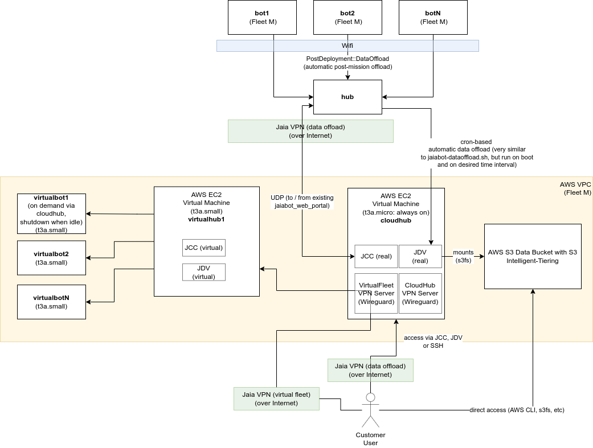

# Cloud Computing

The Jaia Cloud is designed to provide:
- remote access to simulated fleets (intended to be a nearly identical "digital twin" of the corresponding real fleet, if one exists) for user training and scenario planning.
- remote mission planning and control of real fleets over the internet.
- remote access to data storage, analysis and visualization.

## Definitions

- Cloud - remote internet-connected on-demand computing provided (in this case) by Amazon Web Services (AWS) on the Elastic Compute Cloud (EC2) virtual machine system.
- VirtualFleet -  a set of VirtualBots and VirtualHubs that run in the cloud on virtual machines.
- VirtualBot - an amd64 version of the real bot that differs in that all the sensors/actuation are hooked up to simulators rather than the real hardware.
- VirtualHub - Similar to VirtualBot, just for a hub.
- CloudHub - Essentially a "copy" (or secondary hub) of the real fleet's hub (or primary hub) that lives in the cloud rather than in the physical hub hardware. This can send commands / receive data from the real fleet efficiently. 

## Network addresses

The network address assignment for the Jaia Cloud is intended to complement the existing fleet specific [VPN](page55_vpn.md). This means that a given fleet may have up to three VPN subnets assigned:

1. "fleet VPN": The fleet VPN for remote support (vpn.jaia.tech)
2. "virtualfleet VPN": The virtual fleet VPN for access to the "digital twin" virtual fleet.
3. "cloudhub VPN": The data offload / remote control VPN for access to the real fleet from the CloudHub.

These all need to be different because:

- The customer may choose the host both the virtualfleet and cloudhub VPN on their own (secure) AWS account and not provide Jaia access.
- Some customers will not have a VirtualFleet at all.
- Some customers may want to restrict access to the Cloudhub to a different set of users than those who have access to the VirtualFleet (e.g., trainees not able to accidentally command real fleet).

### IPv4 

1. Fleet VPN: The IPv4 addresses remain as assigned in [VPN](page55_vpn.md) document: 172.23.flt.bot_or_hub, where flt = Fleet ID, bot_or_hub = 10 + hub ID or 100 + bot ID.
2. VirtualFleet VPN / CloudHub VPN: No IPv4 addresses are assigned except for the VPN server itself (to allow connections from IPv4 only customers).

### IPv6 

#### Prefix

The prefix is `fd00::/8` for unique local addresses as defined in [RFC4193](https://www.rfc-editor.org/rfc/rfc4193.html).

The full 48-bit prefix was (pseudo)-randomly generated as per RFC4193 for each of the three VPN classes.

| VPN Class        | IPv6 Prefix             |
|------------------|-------------------------|
| Fleet VPN        | `fd91:5457:1e5c::/48`   |
| VirtualFleet VPN | `fd6e:cf0d:aefa::/48`   |
| CloudHub VPN     | `fd0f:77ac:4fdf::/48`   |

#### Subnet 

For each VPN class, the Subnet ID is the Fleet ID, so for example, VirtualFleet 3 would have the subnet `fd6e:cf0d:aefa:3::/64`. This allows up to 2^16 = 65536 fleets to be assigned.

#### Address

For a given node (bot or hub) on the VPN, the 64-bit interface identifier is given as `::0:hub_id` for hubs and `::1:bot_id` for bots. This allows up to 2^16 = 65536 bots and hubs to be assigned per fleet.

Some examples include:

| Fleet     | Bot or Hub? | ID  | Fleet VPN Address  |  VirtualFleet VPN Address  |  CloudHub VPN Address  |
|-----------|-------------|-----|--------------------|--------------------|--------------------|
| 4        | Bot         | 5   | `fd91:5457:1e5c:4::1:5` | `fd6e:cf0d:aefa:4::1:5` | `fd0f:77ac:4fdf:4::1:5` |
| 3001      | Bot         | 6   | `fd91:5457:1e5c:bb9::1:6` | `fd6e:cf0d:aefa:bb9::1:6` | `fd0f:77ac:4fdf:bb9::1:6` |
| 235       | Hub         | 574 | `fd91:5457:1e5c:eb::0:23e` | `fd6e:cf0d:aefa:eb::0:23e` | `fd0f:77ac:4fdf:eb::0:23e` |

