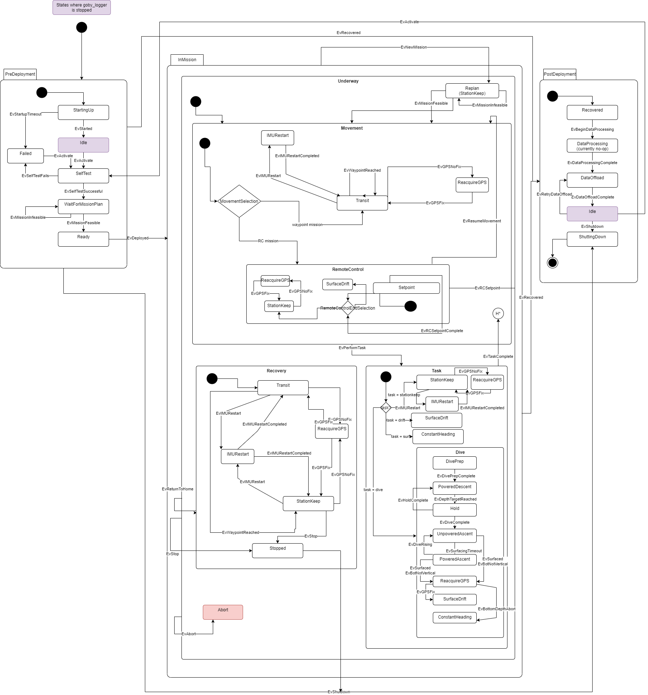
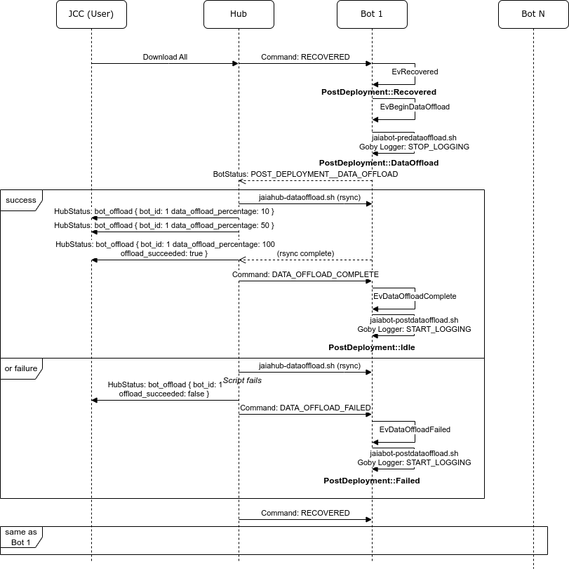

# Mission Management

The `jaiabot_mission_manager` maintains a state machine that oversees the overall mission progression from the viewpoint of the Bot.

## State machine

The JaiaBot maintains a hierarchical state machine (HSM), also referred to as a statechart, that keeps track of the bot's mission state from PreDeployment, through the in-water "Underway" operations, and finalizing with PostDeployment:



(States shown in red and their child states still need to be implemented).

The goal is to keep the state machine as simple as possible while still supporting all the desired [Use Cases](https://jaia-innovation.atlassian.net/wiki/spaces/PD/pages/389775371/Use+Cases).

### States

- PreDeployment: To be performed before the bot is in the water. (Use Cases: "Pre Mission", "Mission Planning", and "System Readiness")
	+ StartingUp: Bot is waiting for the system and all JaiaBot processes to start (initial state). 
	+ SelfTest: Bot checks system statuses and functionality.
	+ Failed: Bot has a fault that does not allow it to perform any mission.
	+ WaitForMissionPlan: Bot waits for a mission plan from the operator
	+ Ready: Bot is ready for deployment.
- InMission: Holds state variables for a given mission (what goal / task we are on). Leaving InMission resets all data related to that mission.
	- Underway: To be performed while the bot is in the water. (Use Cases: "Mission", "Recovery")
		+ Movement: Bot is moving to the next Task.
			* Transit: Bot is transiting to the next waypoint autonomously using the pHelmIvP Waypoint behavior.
			* RemoteControl: Bot is accepting RC setpoints from the UI. When RC commands aren't being received (for any reason), the bot is controlled by an underlying pHelmIvP StationKeep behavior that activates on the current bot location.
				- Setpoint: Bot is performing a RC setpoint (heading, speed up to a given duration)
				- ReacquireGPS: Bot is waiting (on the surface) for the GPS to reacquire a fix.
				- StationKeep: Bot is stationkeeping while waiting for the next Setpoint.
				- SurfaceDrift: Bot is drifting while waiting for the next Setpoint.
			* ...: Can be expanded in the future to allow other types of Movement states as needed
		+ Task: Bot is performing a sampling, station keeping, or other discrete task.
			* StationKeep: Bot is actively maintaining a position on the surface.
			* SurfaceDrift: Bot is drifting (propulsor off).
			* Dive: Bot performs a dive maneuver.
				- PrePoweredDescent: Bot is stopping at dive location.
				- PoweredDescent: Bot is diving by powered reverse thrust.
				- Hold: Bot is maintaining a specific depth.
				- UnpoweredAscent: Bot thruster is off, waiting for bot to ascend.
				- PoweredAscent: Bot is performing a powered ascent to the surface.
				- ReacquireGPS: Bot is waiting (on the surface) for the GPS to reacquire a fix.
				- SurfaceDrift: Bot is drifting to estimate currents.
				- ConstantHeading: Bot is driving on a constant heading for a certain time.
			* ConstantHeading: Bot is driving on a constant heading for a certain time.
			* ...: Can be expanded in the future for other types of Tasks.
		+ Recovery: Bot is returning to a safe location for recovery.
			* Transit: Bot is transiting to the recovery location.
			* ReacquireGPS: Bot is waiting (on the surface) for the GPS to reacquire a fix.
			* IMURestart: Bot is waiting (on the surface) for the IMU to restart.
			* StationKeep: Bot is actively maintaining the recovery location position.
			* Stopped: Control surfaces are stopped for a safe recovery.
		+ Replan: Bot has received a new mission and is assessing feasibility. The bot stationkeeps while in this state.
	- Pause: Vehicle is currently pausing the mission to reinitialize sensors or due to an operator command.
		* ReacquireGPS: Bot is waiting (on the surface) for the GPS to reacquire a fix.
		* IMURestart: Bot is waiting (on the surface) for the IMU to restart.
		* Manual: Operator has commanded the bot to pause its mission.
        * ResolveNoForwardProgress: Bot is not moving forward when it should be. Attempt to resolve this issue.
- PostDeployment: To be performed after the bot is in the water. (Use Cases: "Post Mission")
	+ Recovered: Bot has been recovered.
	+ DataOffload: Hub is downloading data from Bot.
	+ Idle: Bot is awaiting a command to reset for a new mission or shut down. If a new mission is sent, goby_logger is started.
	+ Failed: Hub could not download data.
	+ ShuttingDown: Bot is cleanly powering down.

### Events

Events are what drives the changes in states. Some events are triggered by the operator, some by the bot autonomy, and some by changes in the environment (or in some cases a single event could be triggered by multiple means). 

#### Implemented Events

- EvStarted: Bot has successfully started. This is triggered by a `jaiabot_health` health report considered OK (*not* HEALTH__FAILED unless ENGINEERING_TEST__IGNORE_SOME_ERRORS and the excluded error would make health OK).
- EvStartedTimeout: Timeout without EvStarted (Config value `startup_timeout`).
- EvActivate: Bot is activated (primarily this starts logging). This is manually sent from Central Command using the Command type: ACTIVATE.
- EvSelfTestSuccessful: The bot self test has completed successfully and no critical failures have been found. Currently, this is the same condition as EvStarted.
- EvSelfTestFails: The bot self test fails and the bot is unable to perform a mission. This occurs when the health report is not considered OK (inverse of EvSelfTestSuccessful). 
- EvMissionFeasible: Triggered by `jaiabot_mission_manager` if the received mission should be feasible within the various constraints (power, etc.). Will be triggered by the `jaiabot_mission_manager` upon receipt of a mission plan from the operator. Currently the only feasibility check is that the mission is well-formed (e.g. it has a goal and a valid recovery location).
- EvMissionInfeasible: Triggered by `jaiabot_mission_manager` if the received mission is not feasible (inverse of EvMissionFeasible).
- EvDeployed: Triggered when the bot enters the water, depending on the value of the MissionStart enumeration given in the mission plan: 
	+ START_IMMEDIATELY: EvDeployed is immediately posted by the Ready state entry.
	+ START_ON_COMMAND: EvDeployed is posted when a Command is received of type = START_MISSION. 
- EvWaypointReached: Triggered when the bot reaches the next waypoint. This is triggered via the pHelmIvP waypoint behavior publication (which is published as `jaiabot::groups::mission_ivp_behavior_report`).
- EvPerformTask: Triggered in a variety of ways depending on the mission (movement) type:
	- Transit: Triggered when EvWaypointReached is posted. No data are passed so the next task in the mission is used.
	- RemoteControl: Triggered via the operator UI using Command type: REMOTE_CONTROL_TASK. The desired manual task is passed a parameter to this event.
- EvTaskComplete: Triggered when the task has been completed. This can be triggered in a variety of ways, depending on the task:
	+ No task: Triggered immediately so that the bot returns to Movement.
	+ StationKeep: Triggered when the Command type: NEXT_TASK is sent by the operator
	+ Dive: Triggered when the dive is completed.
	+ SurfaceDrift: Triggered when the drift timer expires. (or Command type: NEXT_TASK is sent by the operator.).
- EvNewMission: Triggered when the operator sends a new mission and the bot receives it.
- EvReturnToHome: Triggered by the Movement::Transit state when the mission has completed all the preprogrammed waypoints, or via a command from the operator.
- EvRecoveryPointReached: Triggered by the pHelmIvP behavior once the recovery point has been reached.
- EvStop: Triggered by a command from the operator (Command type: STOP)
- EvShutdown: Triggered by the operator with Command type: SHUTDOWN.
- EvDepthTargetReached: Triggered when the Dive behavior reaches a target depth.
- EvHoldComplete: Triggered when the depth target hold timeout expires.
- EvDiveComplete: Triggered when the final depth and hold has been reached (or the bottom is detected).
- EvSurfacingTimeout: Triggered when the bot has not surfaced after a set amount of time.
- EvSurfaced: Triggered when the bot has reached the surface.
- EvResumeMovement: Triggered by a command from the operator (type == REMOTE_CONTROL_RESUME_MOVEMENT) to put the bot out of RemoteControl and back into the mission's Movement state (which could still be RemoteControl).
- EvRCSetpoint: Triggered by the operator providing a new remote control setpoint.
- EvRCSetpointComplete: Triggered when the setpoint duration is exceeded.
- EvRecovered: Triggered when the operator sends Command type: RECOVERED
- EvBeginDataOffload: Automatically triggered upon entry to Recovered.
- EvDataOffloadComplete: Triggered when the jaiabot_hub_manager sends Command type: DATA_OFFLOAD_COMPLETE.
- EvDataOffloadFailed: Triggered when the jaiabot_hub_manager sends Command type: DATA_OFFLOAD_FAILED.
- EvRetryDataOffload:  Triggered when the operator sends Command type: RETRY_DATA_OFFLOAD.
- EvGPSFix: Triggered whe the GPS Fix meets our requirements. 
- EvGPSNoFix: Triggered whe the GPS Fix does not meet our requirements.
- EvIMURestart: Triggered when we detect an IMU Issue.
- EvIMURestartCompleted: Triggered when the IMU Restart is completed.
- EvBottomDepthAbort: Triggered when bot depth reaches a minimum value (default is set to 0). Bot will drive to last goal after doing a constant heading.
- EvDviePrepComplete: Triggered when the the timeout is reached in the DivePrep State. 
- EvDiveRising: Triggered when bot is making progress to the surface while in PoweredAscent. The bot will switch back into UnpoweredAscent.
- EvBotNotVertical: Triggered when the bot is not vertical while in PoweredAscent. The bot will switch back into UnpoweredAscent.
- EvRCOverrideFailed: Triggered when a feasible RC mission is received and the bot is in a failed state. This is an override so the operator can attempt to drive their bot to safety.
- EvNoForwardProgress: Triggered when bot is in IvP control, desired speed is larger than a threshold (e.g., 0), and the pitch is greater than a threshold (e.g., 30 deg), indicating the bot is not making forward (horizontal) progress.
- EvForwardProgressResolved: Triggered when the difficulty making forward progress is resolved (currently triggered after a timeout).

#### Internal events

These are not shown on the diagram but used for providing data to the state machine.

- EvLoop: Triggered on the regular (1 Hz) loop() timer for the Goby Application.
- EvBotDepth: Triggered whenever new depth information is received from the bot sensors (event contains the depth value as a parameter).
- EvMeasurement: Sensor data measurement. 
- EvVehicleGPS: Triggered when we receive GPS information, currently HDOP and PDOP information.
- EvVehiclePitch: Triggered when we receive IMU information, currently pitch information.

#### Unimplemented Events

- EvAbort: Abort triggered.


### State data

Data is scoped to the innermost state that must have access to the data ([state local storage](https://www.boost.org/doc/libs/1_70_0/libs/statechart/doc/faq.html#StateLocalStorage)). This ensures when that state is exited the data are reinitialized (e.g. EvNewMission exits Underway so that automatically reinitializes the goal_index, etc.).

- MissionManagerStateMachine:
	+ **state**: Current state enumeration. Set automatically by the Notify class upon entry of a new state based on the equivalent template parameter.
	+ **plan**: Currently active mission plan. Updated when a valid feasible plan is received.
	+ **geodesy**: Current geodetic conversion tool (goby::util::UTMGeodesy). The datum is set to the current mission **plan**'s first goal point.
	+ **setpoint_type**: Current control setpoint type enumeration. Set automatically by the Notify class based on the equivalent template parameter.
- Underway: 
	+ **goal_index**: Keeps track of the index in the mission **plan** for the current goal.
	+ **mission_complete**: True if all the goals in the current mission **plan** have been reached.

## Supporting Use Cases

This section briefly describes how the statechart supports the desired bot use cases.

### Common

Nominal progression (in all use cases):

- PreDeployment::Off 
	- bot powers on
- PreDeployment::SelfTest
	- self test completes OK
- PreDeployment::WaitForMissionPlan
	- operator sends mission plan
- PreDeployment::Ready
	- operator deploys bot into water
- Underway::*
	- *mission specific*
- Underway::Recovery::Stopped
	- operator picks up bot
- PostDeployment::Recovered
	- data offload begins
- PostDeployment::DataOffload
	-  data upload completes
- PostDeployment::Idle
 	- operator sends shutdown command
- PostDeployment::ShuttingDown
	- bot powers off and we're done

### Mission Types

- Waypoint Mission: 
	- Set of waypoints loaded (one at a time) into the pHelmIvP waypoint behavior and managed by toggling between Underway::Movement::Transit and Underway::Task::* until the waypoints are completed.
	- Upon completion of waypoints, EvReturnToHome is automatically triggered and the Recovery sequence begins.  
- Optimized Survey Mission (*unimplemented*)
	+ Topside software (presumably `jaiabot_hub_manager`) generates a set of waypoints from the operation region and number of bots to create a mission plan so this is identical to the Waypoint mission as far as each bot is concerned.
- Retasking Use case
	+ This is handled by EvNewMission, which triggers the bot to Replan the mission and either begin execution (Movement) or stationkeep within Replan if the plan is infeasible (e.g. battery too low). The operator can then choose to send a feasible plan or recover.
- Single Bot Remote Control Use Case
	+ This is handled using the Movement::RemoteControl state, toggling to the Task::* states via commands from the operator. When the operator isn't providing RC setpoint commands, the RemoteControl state will use setpoints from the pHelmIvP stationkeep behavior (until RC setpoints commands are received again). Manual tasks can be sent by the operator as desired during this state.
- Survey Mission to Single Bot Remote Control Use Case
	+ This is handled by sending a standard mission plan containing waypoint goals (as Waypoint Mission or Optimized Survey Mission)
	+ When the operator chooses, the RemoteControl setpoints can be sent which move the bot into the Movement::RemoteControl state. From here the operator can issue manual tasks as desired to perform. When the RC part of the mission is over, the operator can resume the original mission plan by sending REMOTE_CONTROL_RESUME_MOVEMENT.


## Log offload

The logs are automatically offloaded onto the hub as part of the PostDeployment state of the mission manager.

This process is automatically initiated when the vehicle is Recovered (or the user commands "RECOVERED"). The bot is responsible for staging the data required to be offloaded (`jaiabot-predataoffload.sh`), but the hub actually performs the `rsync` based data copy in the `jaiahub-dataoffload.sh` script (so that the bots do not need `ssh` credentials to log into the hub).

After the data are copied, the bot archives the copied logs and deletes old (>7 days) logs using the `jaiabot-postdataoffload.sh` script.

The complete process is diagrammed here:




### Engineering Test Overrides

For various engineering tests, it is helpful to bypass parts of the state machine or change other normal behavior.

The overrides are set using one or more `test_mode` enumeration settings. *Warning: Use of these overrides may cause unpredictable or unsupported bot behavior and should not be used for regular operations.*

#### Ignore some errors 

To allow "normal" operation even the presence of one or more errors you can set:

```
test_mode: ENGINEERING_TEST__IGNORE_SOME_ERRORS
```

The errors to be ignored then must be set using one or more `ignore_error` enums (defined in `health.proto`), such as: 

```
ignore_error: ERROR__MISSING_DATA__PRESSURE
ignore_error: ERROR__SYSTEM__DATA_DISK_SPACE_CRITICAL
```

When running the bot without GPS, "Indoor Mode" (see below) will automatically set the appropriate `ignore_error` flags (i.e., `ignore_error: ERROR__MISSING_DATA__GPS_FIX`, etc.).

#### Always log

Normally the bot stops logging when Idle to save disk space. This can be changed to always log using:

```
test_mode: ENGINEERING_TEST__ALWAYS_LOG_EVEN_WHEN_IDLE
```

#### Indoor Mode

To run the bot without GPS (e.g. indoors in a tank), the following mode can be used:

```
test_mode: ENGINEERING_TEST__INDOOR_MODE__NO_GPS
```

