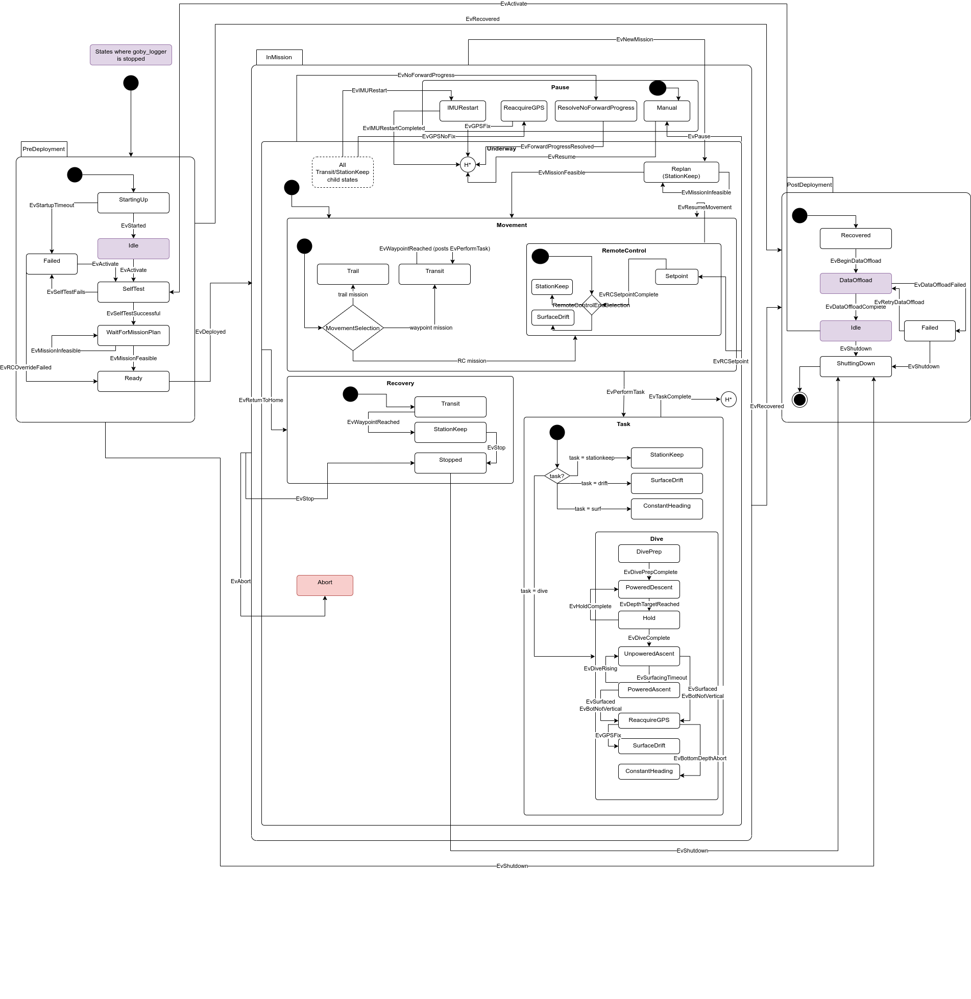

# Mission Management

The `jaiabot_mission_manager` maintains a state machine that oversees the overall mission progression from the viewpoint of the Bot.

## State machine

The JaiaBot maintains a hierarchical state machine (HSM), also referred to as a statechart, that keeps track of the vehicle's mission state from PreDeployment, through the in-water "Underway" operations, and finalizing with PostDeployment:

(States shown in red and their child states still need to be implemented).

The goal is to keep the state machine as simple as possible while still supporting all the desired [Use Cases](https://jaia-innovation.atlassian.net/wiki/spaces/PD/pages/389775371/Use+Cases).

### States

- PreDeployment: To be performed before the vehicle is in the water. (Use Cases: "Pre Mission", "Mission Planning", and "System Readiness")
	+ Off: Vehicle is powered off (initial state). This is a somewhat meaningless state in practice but is included for the sake of completeness.
	+ SelfTest: Vehicle checks system statuses and functionality.
	+ Failed: Vehicle has a fault that does not allow it to perform any mission.
	+ WaitForMissionPlan: Vehicle waits for a mission plan from the operator
	+ Ready: Vehicle is ready for deployment.
- Underway: To be performed while the vehicle is in the water. (Use Cases: "Mission", "Recovery")
	+ Movement: Vehicle is moving to the next Task.
		* Transit: Vehicle is transiting to the next waypoint autonomously using the pHelmIvP Waypoint behavior.
		* RemoteControl: Vehicle is accepting RC commands from the UI. When RC commands aren't being received (for any reason), the vehicle is controlled by an underlying pHelmIvP StationKeep behavior that activates on the current vehicle location.
		* ...: Can be expanded in the future to allow other types of Movement states as needed
	+ Task: Vehicle is performing a sampling, station keeping, or other discrete task.
		* StationKeep: Vehicle is actively maintaining a position on the surface.
		* SurfaceDrift: Vehicle is drifting (propulsor off).
		* Dive: Vehicle performs a dive maneuver. 
			- PoweredDescent: Vehicle is diving by powered reverse thrust.
			- Hold: Vehicle is maintaining a specific depth.
			- UnpoweredAscent: Vehicle thruster is off, waiting for vehicle to ascend.
			- PoweredAscent: Vehicle is performing a powered ascent to the surface.
		* ...: Can be expanded in the future for other types of Tasks.
	+ Recovery: Vehicle is returning to a safe location for recovery.
		* Transit: Vehicle is transiting to the recovery location.
		* StationKeep: Vehicle is actively maintaining the recovery location position.
		* Stopped: Control surfaces are stopped for a safe recovery.
	+ Replan: Vehicle has received a new mission and is assessing feasibility.
- PostDeployment: To be performed after the vehicle is in the water. (Use Cases: "Post Mission")
	+ Recovered: Vehicle has been recovered.
	+ DataProcessing: First the goby_logger is stopped. Vehicle is doing automatic post mission conversions (e.g. .goby to HDF5, etc.). 
	+ DataOffload: Vehicle is uploading data to a pre-configured storage location.
	+ Idle: Vehicle is awaiting a command to reset for a new mission or shut down. If a new mission is sent, goby_logger is started.
	+ ShuttingDown: Vehicle is cleanly powering down.

### Events

Events are what drives the changes in states. Some events are triggered by the operator, some by the vehicle autonomy, and some by changes in the environment (or in some cases a single event could be triggered by multiple means). 

#### Implemented Events

- EvTurnOn: Vehicle is powered on. This state is automatically entered by `jaiabot_mission_manager` as if it is running, by definition the vehicle has been powered on.
- EvSelfTestSuccessful: The vehicle self test has completed successfully and no critical failures have been found. This is triggered by a yet-to-be-determined health monitoring application. Currently as a passthrough, this is always posted upon startup.
- EvMissionFeasible: Triggered by `jaiabot_mission_manager` if the received mission should be feasible within the various constraints (power, etc.). Will be triggered by the `jaiabot_mission_manager` upon receipt of a mission plan from the operator. Currently the only feasibility check is that the mission has at least one goal.
- EvMissionInfeasible: Triggered by `jaiabot_mission_manager` if the received mission is not feasible within the various constraints (power, etc.). Will be triggered by the `jaiabot_mission_manager` upon receipt of a mission plan from the operator.
- EvDeployed: Triggered when the vehicle enters the water, depending on the value of the MissionStart enumeration given in the mission plan: 
	+ START_IMMEDIATELY: EvDeployed is immediately posted by the Ready state entry.
	+ START_ON_COMMAND: EvDeployed is posted when a Command is received of type = START_MISSION. 
- EvWaypointReached: Triggered when the vehicle reaches the next waypoint. This is triggered via the pHelmIvP waypoint behavior publication (which is published as `jaiabot::groups::mission_ivp_behavior_report`).
- EvPerformTask: Triggered in a variety of ways depending on the mission (movement) type:
	- Transit: Triggered when EvWaypointReached is posted.
- EvTaskComplete: Triggered when the task has been completed. This can be triggered in a variety of ways, depending on the task:
	+ No task: Triggered immediately so that the vehicle returns to Movement.
- EvNewMission: Triggered when the operator sends a new mission and the bot receives it.
- EvReturnToHome: Triggered by the Movement::Transit state when the mission has completed all the preprogrammed waypoints, or via a command from the operator.
- EvRecoveryPointReached: Triggered by the pHelmIvP behavior once the recovery point has been reached.
- EvStopped: Triggered by a command from the operator or by the Abort state.
- EvShutdown: Triggered by the operator.
- EvRedeploy: Triggered by the operator to reset the vehicle back into the PreDeployment state.

#### Unimplemented Events
- EvSelfTestFails: The vehicle self test fails and the vehicle is unable to perform a mission. This is triggered by a yet-to-be-determined health monitoring application.
- EvPerformTask: 
	- RemoteControl: Triggered via the operator UI new task.
- EvTaskComplete:
	+ StationKeep: Not triggered. Rather, EvNewMission is triggered when the operator sends a new mission.
	+ Dive: Triggered when the dive is completed and the vehicle is back on the surface.
	+ SurfaceDrift: Triggered when the drift timer expires. (Or EvNewMission is triggered which starts the new mission).
- EvAbort: Abort triggered by yet-to-be-determined health monitoring process.
- EvRecovered: Triggered when the vehicle detects it is out of the water.
- EvBeginDataProcessing: Triggered by the operator? or automatically upon recovery?
- EvDataProcessingComplete: Triggered by the DataProcessing state when the data have all been processed.
- EvDataOffloadComplete: Triggered by the DataOffload state when the data have all been offloaded.
- EvDepthTargetReached: Triggered when the Dive behavior reaches a target depth.
- EvHoldComplete: Triggered when the depth target hold timeout expires.
- EvSurfacingTimeout: Triggered when the vehicle has not surfaced after a set amount of time.

### State data

Data is scoped to the innermost state that must have access to the data ([state local storage](https://www.boost.org/doc/libs/1_70_0/libs/statechart/doc/faq.html#StateLocalStorage)). This ensures when that state is exited the data are reinitialized (e.g. EvNewMission exits Underway so that automatically reinitializes the goal_index, etc.).

- MissionManagerStateMachine:
	+ **state**: Current state enumeration. Set automatically by the Notify class upon entry of a new state based on the equivalent template parameter.
	+ **plan**: Currently active mission plan. Updated when a valid feasible plan is received.
	+ **geodesy**: Current geodetic conversion tool (goby::util::UTMGeodesy). The datum is set to the current mission **plan**'s first goal point.
	+ **setpoint_type**: Current control setpoint type enumeration. Set automatically by the Notify class based on the equivalent template parameter.
- Underway: 
	+ **goal_index**: Keeps track of the index in the mission **plan** for the current goal.
	+ **mission_complete**: True if all the goals in the current mission **plan** have been reached.

## Supporting Use Cases

This section briefly describes how the statechart supports the desired vehicle use cases.

### Common

Nominal progression (in all use cases):

- PreDeployment::Off 
	- vehicle powers on
- PreDeployment::SelfTest
	- self test completes OK
- PreDeployment::WaitForMissionPlan
	- operator sends mission plan
- PreDeployment::Ready
	- operator deploys vehicle into water
- Underway::*
	- *mission specific*
- Underway::Recovery::Stopped
	- operator picks up vehicle
- PostDeployment::Recovered
	- data processing begins
- PostDeployment::DataProcessing
 	- data processing completes
- PostDeployment::DataOffload
	-  data upload completes
- PostDeployment::Idle
 	- operator sends shutdown command
- PostDeployment::ShuttingDown
	- vehicle powers off and we're done

### Mission Types

- Waypoint Mission: 
	- Set of waypoints loaded (one at a time) into the pHelmIvP waypoint behavior and managed by toggling between Underway::Movement::Transit and Underway::Task::* until the waypoints are completed.
	- Upon completion of waypoints, EvReturnToHome is automatically triggered and the Recovery sequence begins.  
- Optimized Survey Mission (*unimplemented*)
	+ Topside software (presumably `jaiabot_hub_manager`) generates a set of waypoints from the operation region and number of vehicles to create a mission plan so this is identical to the Waypoint mission as far as each vehicle is concerned.
- Retasking Use case
	+ This is handled by EvNewMission, which triggers the vehicle to Replan the mission and either begin execution (Movement) or stationkeep within Replan if the plan is infeasible (e.g. battery too low). The operator can then choose to send a feasible plan or recover.
- Single Vehicle Remote Control Use Case (*unimplemented*)
	+ This is handled using the Movement::RemoteControl state, toggling to the Task::* states via commands from the operator. When the operator isn't providing RC commands, the RemoteControl state will use setpoints from the pHelmIvP stationkeep behavior (until RC commands are received again).