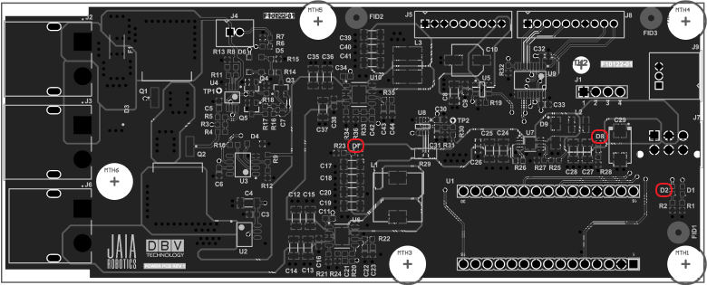
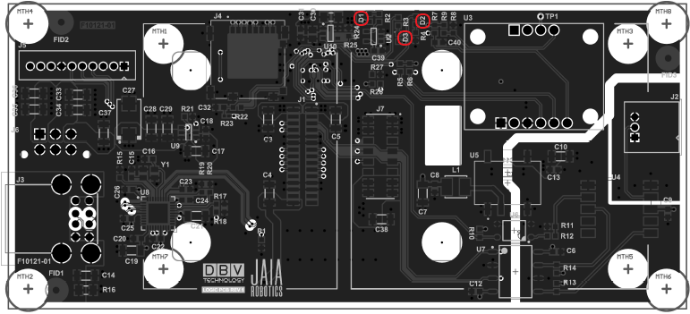

# JaiaBot Hardware Tables

## Arduino Pinout
| Pin | Description | Use              |
| --: | ---         | ---              |
|  1  | V_IN        | No Connection    |
|  2  | GND         | Ground           |
|  3  | PC6/RST     | No Connection    |
|  4  | +5V         | +5V              |
|  5  | A7          | J1 - BRK_3       |  
|  6  | A6          | LED 2 (Doesn't work - can't drive LED from Analog Pin)           |
|  7  | A5/D19      | LED 1            |
|  8  | A4          | LED EXT          |
|  9  | A3          | Current - 5V     |
| 10  | A2          | Current - Vcc    |
| 11  | A1          | Latch Off        |
| 12  | A0          | Voltage - Vcc    |
| 13  | A_REF       | No Connection    |
| 14  | +3V3        | No Connection    |
| 15  | PC5/D13     | SPI - SCLK       |
| 16  | D1/TX/PD1   | UART Tx          |
| 17  | D0/RX/PD0   | UART Rx          |
| 18  | RST/PC6     | Reset            |
| 19  | GND         | Ground           |
| 20  | D2          | ARD_GPIO_AUX     |
| 21  | D3          | PWM - ESC        |
| 22  | D4          | J1 - BRK_2       |
| 23  | D5          | PWM - Rudder     |
| 24  | D6          | PWM - Stbd ELev  |
| 25  | D7          | J1 - BRK_1       |
| 26  | D8          | Actuator Fault   |
| 27  | D9          | PWM - Port Elev  |
| 28  | D10         | Actuator Enable  |
| 29  | D11         | SPI - CIPO       |
| 30  | D12         | SPI - PICO       |

## Power Board J1 Pinout
| Pin | Description | Use              |
| --: | ---         | ---              |
|  1  | GND         | Ground           |
|  2  | BRK_1       | Arduino D7       |
|  3  | BRK_2       | Arduino D4       |
|  4  | BRK_3       | Arduino A7       |

## Power Board J9 Pinout
| Pin | Description |
| --: | ---         |
|  1  | +5V         |
|  2  | LED EXT     |
|  3  | GND         |

## Power Board Lights
| Indicator | Description                        |
| --:       | ---                                |
| D2        | User available output from Arduino |
| D7        | 5 V Rail is active                 |
| D8        | 3.3 V Rail is active               |

## Raspberry Pi Pinout
| Pin    | Description | Notes            |
| --:    | ---         | ---              |
| GPIO6  | Arduino Reset   |           |
| GPIO10 | IMU Embedded Reset   |                  |
| GPIO23 | IMU Retrofit Reset   |                  |
| GPIO26 | XBee Reset  |                  |

## Logic Board Lights
| Indicator | Description                            |
| --:       | ---                                    |
| D1        | Raspberry Pi Compute Module Power      |
| D2        | User available output from Pi (GPIO24) |
| D3        | Raspberry Pi Compute Module Activity   |

## RF Board J4 Pinout
| Pin | Description   |
| --: | ---           |
|  1  | GND_RF        |
|  2  | XBEE_SPI_CS   |
|  3  | XBEE_SPI_CLK  |
|  4  | XBEE_SPI_POCI |
|  5  | XBEE_SPI_CIPO |

## I2C Addresses
| Address | Device                                  |
| --:     | ---                                     |
| 0x28    | Adafruit IMU Breakout - Bosch BNO055    |
| 0x64    | Atlas Scientific EC-OEM Salinity Sensor |
| 0x76    | Blue Robotics Bar30 Pressure Sensor     |
| 0x42    | uBlox NEO-M8M-0 GPS                     |
