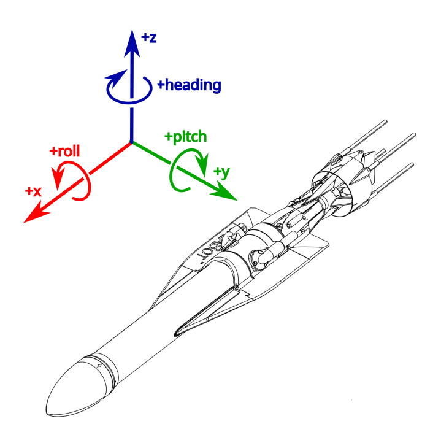

# Jaia IMU Driver

## Coordinate System

The IMU is mounted in the JaiaBot as follows:

* positive x-axis pointing toward the front of the bot
* positive y-axis pointing to the left (port) direction
* positive z-axis pointing up

Orientation of the chip within the JaiaBot:

## Data

### Euler Angles (pitch, roll, and heading)

The Euler Angles are reported as `pitch`, `roll`, and `heading`.  The conventions used are summarized by the table below.

| Euler angle | Description |
| -- | -- |
| `heading` | Reported as degrees east from _magnetic north_.  In other words, magnetic east is $+90\degree$.
| `pitch` | Reported in degrees.  Positive pitch is when the bot's nose is raised above the tail, and negative pitch is when the nose is below the tail.
| `roll` | Reported in degrees.  Positive roll is to starboard, and negative roll is to port.  In other words, when the starboard wing is below the port wing, a positive roll is reported.

### Gravity

The `gravity` vector represents the negative force of gravity, away from the ground.  This vector is reported in the sensor's frame of reference, in units of $m/{s^2}$.  The magnitude of this vector will be close to Earth's gravitational constant, $g_0\approx9.8m/{s^2}$.

#### Examples

| Orientation | Pitch ($\degree$) | Roll ($\degree$) | `gravity` (xyz) |
| ----------- | -------- | -- | --------------- |
|  | 0 | 0 | `(-0.4, -0.03, 9.95)` |
|  | +33 | 0 | `(5.5, 0.3, 8.1)` |
|  | 0 | +88 | `(-1.29, 9.7, 0.8)` |

### Linear acceleration

The `linear_acceleration` vector points in the direction of the acceleration.  This vector is also reported in units of $m/{s^2}$.

The following table gives some example output.

| Acceleration Direction | `linear_acceleration` (xyz) |
| ----------- | --------------- |
| Forward | `(2.4, -0.03, 0.07)` |
| Port | `(0.04, 2.8, -0.05)` |
| Up | `(-0.07, 0.06, 2.9)` |
| Backward | `(-2.4, 0.04, -0.04)` |
| Starboard | `(0.05, -2.2, 0.07)` |
| Down | `(0.04, 0.05, -2.1)` |

### Quaternion

The `quaternion` vector is given in the original `Hamilton` formulation, where $ij=k$.  The `quaternion` behaves as in the following chart.

| Orientation | Pitch ($\degree$) | Roll ($\degree$) | `quaternion` (wxyz) |
| ----------- | -------- | -- | --------------- |
|  | 0 | 0 | `(0.55, 0.01, -0.01, -0.8)` |
|  | +32 | 0 | `(0.53, -0.17, -0.19, -0.8)` |
|  | 0 | +87 | `(0.39, 0.45, -0.52, -0.58)` |

Because of the way the IMU is mounted, when converting the quaternion to Euler angles, we must multiply the `heading` and `pitch` by -1.  This is because the `+y` axis is pointed toward port, and the `+z` axis is pointed upward. 

For example, this must be taken into consideration when applying formulae like in the following article:

[Quaternion to Euler angles (in_3-2-1_sequence) conversion (Wikipedia)](https://en.wikipedia.org/wiki/Conversion_between_quaternions_and_Euler_angles#Quaternion_to_Euler_angles_(in_3-2-1_sequence)_conversion)
