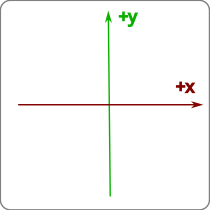
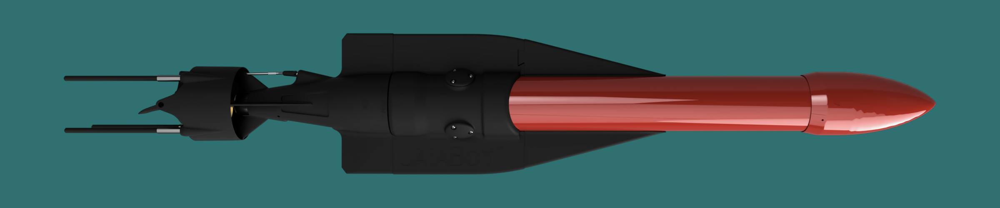
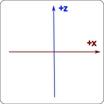
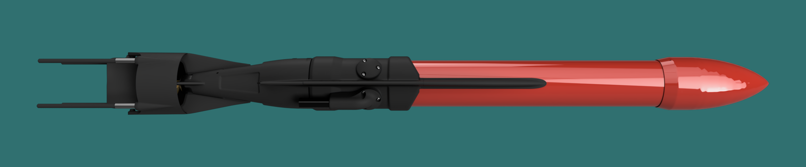
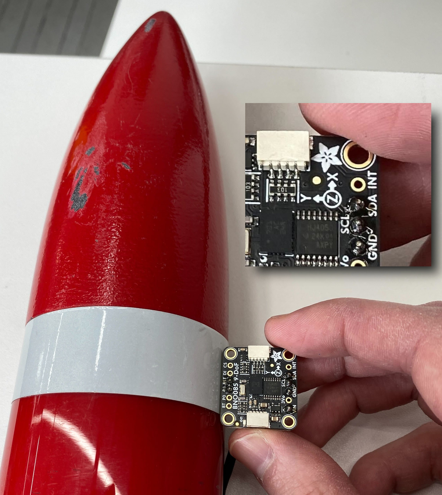
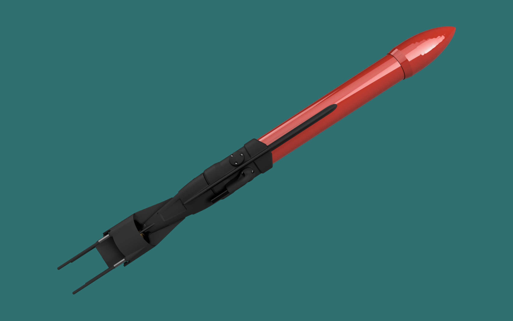

# Jaia IMU Driver

## Coordinate System

The IMU is mounted in the JaiaBot as follows:

* positive x-axis pointing toward the front of the bot
* positive y-axis pointing to the left (port) direction
* positive z-axis pointing up

| Axes | Bot |
| - | - |
|  |  |
|  |  |

Orientation of the chip within the JaiaBot:

## Data

### Euler Angles (pitch, roll, and heading)

The Euler Angles are reported as `pitch`, `roll`, and `heading`.  The conventions used are summarized by the table below.

| Euler angle | Description |
| -- | -- |
| `heading` | Reported as degrees east from _magnetic north_.  In other words, magnetic east is $+90\degree$.
| `pitch` | Positive pitch is when the bot's nose is raised above the tail, and negative pitch is when the nose is below the tail.  Reported in degrees.
| `roll` | Positive roll is to starboard, and negative roll is to port.  In other words, when the starboard elevator is below the port elevator, a positive roll is reported.  Reported in degrees.

### Gravity

The `gravity` vector points in the upward direction, away from the ground.  This vector is reported in units of $m/{s^2}$.  The magnitude of this vector will be close to Earth's gravitational constant, $g_0\approx9.8m/{s^2}$.

#### Examples

| Orientation | Pitch ($\degree$) | Roll ($\degree$) | `gravity` (xyz) |
| ----------- | -------- | -- | --------------- |
|  | 0 | 0 | `(-0.4, -0.03, 9.95)` |
|  | +33 | 0 | `(5.5, 0.3, 8.1)` |
|  | 0 | +88 | `(-1.29, 9.7, 0.8)` |

### Linear acceleration

The `linear_acceleration` vector points in the direction of the acceleration.  This vector is also reported in units of $m/{s^2}$.

