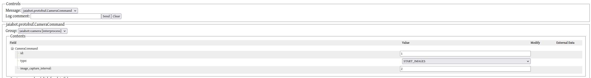

# JaiaBot Camera Driver

This directory contains the JaiaBot camera driver that runs on the Pi Zero.  It receives `CameraCommand` messages over a serial connection from the main JaiaBot Raspberry Pi.  The `CameraCommand` messages can be used to start/stop video or start/stop taking still images at a fixed rate.

## Deploying the driver to the Pi Zero

To deploy this driver to a Pi Zero, you can use the included deploy script as follows:

```
me@mycomputer$ ./deploy_camera_driver.sh <Pi Zero's IP address or hostname>
```

This script performs the following tasks:

* Copies the driver and its required modules to the Pi Zero
* Creates the python vitual environment (venv) for the camera driver
* Installs, enables, and starts the camera driver as a systemd service on the Pi Zero

## Testing the camera

Once the camera driver is installed to the Pi Zero, and the JaiaBot software is deployed to the main Raspberry Pi, you can test the camera by sending `CameraCommand` messages via the bot's Jaia liaison interface.  This is found by navigating your browser to the URL `http://<bot IP or hostname>:30000`.


