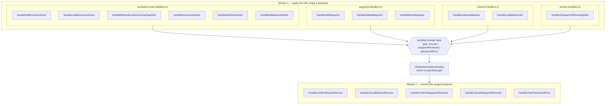
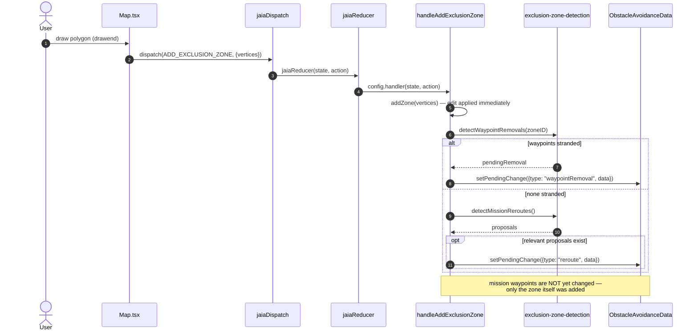
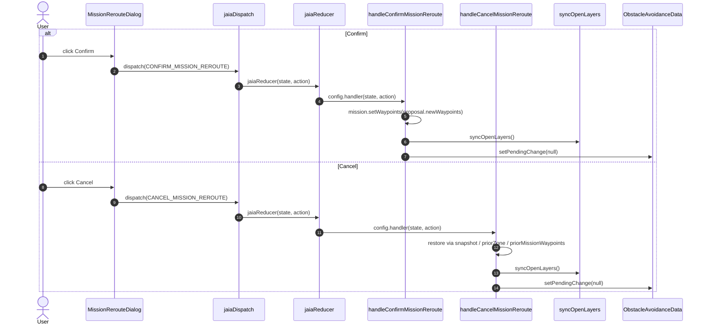

# Obstacle avoidance: two event streams

_Status: historical snapshot, taken before
[`05EXCLUSION_ZONE_HANDLERS_PLAN.md`](./05EXCLUSION_ZONE_HANDLERS_PLAN.md).
Superseded by [`07EVENT_STREAMS.md`](./07EVENT_STREAMS.md) for the current
architecture — the `revert`/`RevertContext`/`loadSummary` contract below no
longer matches the code. Kept as-is for the pre-refactor picture._

Traced from `subtask/consolidate-dialogs/SW-2493`. The system is a fan-in /
fan-out, not a single pipeline: **12 producer functions** across 4 handler
files each apply a user edit immediately and _stage_ a proposal; **5
consumer functions** in one file resolve whatever got staged, regardless of
which producer staged it.

## 1. Architecture: fan-in → shared contract → fan-out

**Key point:** stream 2 never inspects which producer fired. It branches
only on which optional fields are present in the staged data
(`triggeringZoneID`, `priorZone`, `priorMissionWaypoints`, `loadedZoneIDs`,
`loadedMissionIDs`, `offendingZoneIDs`, or a full mission/zone-set snapshot)
— that's the entire contract between the two streams.

`placementError` is a third, simpler case: for those, the producer already
reverted its own edit synchronously _before_ staging the dialog (see
`handleAddWaypoint`'s `OVER_LIMIT`/`IMPOSSIBLE` branches below), so the only
consumer is a plain dismiss — `handleClearPlacementError` — with nothing
left to revert.

## 2. Stream 1 — producers

Every row: apply the primitive edit → run `detectWaypointRemovals` /
`detectMissionReroutes` → stage a proposal (or self-revert and show a
blocking error).

| File                       | Function                             | Line                                                             | Stages                                         |
| -------------------------- | ------------------------------------ | ---------------------------------------------------------------- | ---------------------------------------------- |
| exclusion-zone-handlers.ts | `handleAddExclusionZone`             | [25](../../../context/handlers/exclusion-zone-handlers.ts#L25)   | waypointRemoval (35) · reroute (57)            |
|                            | `handleLoadExclusionZones`           | [118](../../../context/handlers/exclusion-zone-handlers.ts#L118) | waypointRemoval (144, 151) · reroute (176)     |
|                            | `handleRestoreExclusionZoneSnapshot` | [212](../../../context/handlers/exclusion-zone-handlers.ts#L212) | waypointRemoval (225) · reroute (252)          |
|                            | `handleMoveZoneVertex`               | [310](../../../context/handlers/exclusion-zone-handlers.ts#L310) | waypointRemoval (337) · reroute (355)          |
|                            | `handleAddZoneVertex`                | [428](../../../context/handlers/exclusion-zone-handlers.ts#L428) | waypointRemoval (456) · reroute (474)          |
|                            | `handleDeleteZoneVertex`             | [499](../../../context/handlers/exclusion-zone-handlers.ts#L499) | reroute (517)                                  |
| waypoint-handlers.ts       | `handleAddWaypoint`                  | [31](../../../context/handlers/waypoint-handlers.ts#L31)         | placementError (37, 49, 65, 75) · reroute (83) |
|                            | `handleDeleteWaypoint`               | [105](../../../context/handlers/waypoint-handlers.ts#L105)       | placementError (128, 137) · reroute (145)      |
|                            | `handleMoveWaypoint`                 | [166](../../../context/handlers/waypoint-handlers.ts#L166)       | placementError (168, 205, 214) · reroute (223) |
| mission-handlers.ts        | `handleDuplicateMission`             | [61](../../../context/handlers/mission-handlers.ts#L61)          | waypointRemoval (77) · reroute (84)            |
|                            | `handleLoadMissionSet`               | [180](../../../context/handlers/mission-handlers.ts#L180)        | waypointRemoval (204) · reroute (230)          |
| survey-handlers.ts         | `handleChangeGridPlanningState`      | [26](../../../context/handlers/survey-handlers.ts#L26)           | waypointRemoval (103) · reroute (114)          |

## 3. Stream 2 — consumers

All five live in `obstacle-avoidance-handlers.ts`, and only these functions
ever mutate a mission based on a _proposal_ (insert bypass waypoints, delete
an unroutable mission, or revert).

| Function                       | Line                                                                 | On the wire from           | Does                                                                                         |
| ------------------------------ | -------------------------------------------------------------------- | -------------------------- | -------------------------------------------------------------------------------------------- |
| `handleConfirmMissionReroute`  | [18](../../../context/handlers/obstacle-avoidance-handlers.ts#L18)   | `CONFIRM_MISSION_REROUTE`  | writes `proposal.newWaypoints` into each mission; deletes `OVER_LIMIT`/`IMPOSSIBLE` missions |
| `handleCancelMissionReroute`   | [49](../../../context/handlers/obstacle-avoidance-handlers.ts#L49)   | `CANCEL_MISSION_REROUTE`   | branches on which snapshot/prior-state field is present to fully undo the triggering edit    |
| `handleConfirmWaypointRemoval` | [107](../../../context/handlers/obstacle-avoidance-handlers.ts#L107) | `CONFIRM_WAYPOINT_REMOVAL` | applies the removal proposal, plus any feasible follow-up reroute, in one operation          |
| `handleCancelWaypointRemoval`  | [143](../../../context/handlers/obstacle-avoidance-handlers.ts#L143) | `CANCEL_WAYPOINT_REMOVAL`  | same revert branching as above, scoped to the removal's staged data                          |
| `handleClearPlacementError`    | [197](../../../context/handlers/obstacle-avoidance-handlers.ts#L197) | dismiss                    | clears the dialog only — the producer already self-reverted                                  |

## 4. Stream 1 in detail — one producer, worked example

`handleAddExclusionZone` is representative of the pattern all 12 producers
follow.

## 5. Stream 2 in detail — resolving a reroute proposal

`handleConfirmWaypointRemoval` / `handleCancelWaypointRemoval` are
structurally identical to this pair — same dispatch → reducer → handler →
`syncOpenLayers` → `setPendingChange(null)` shape — just resolving
`pendingState.data` for a `"waypointRemoval"` instead of a `"reroute"`.
