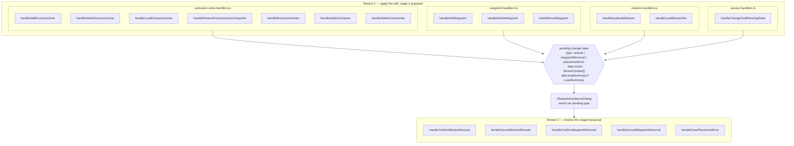
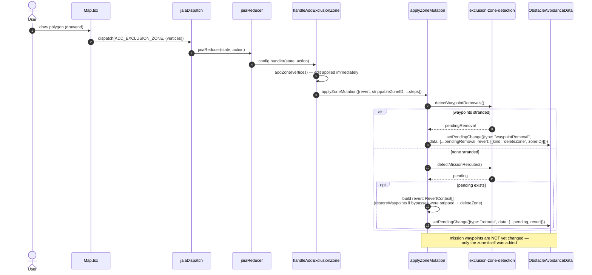
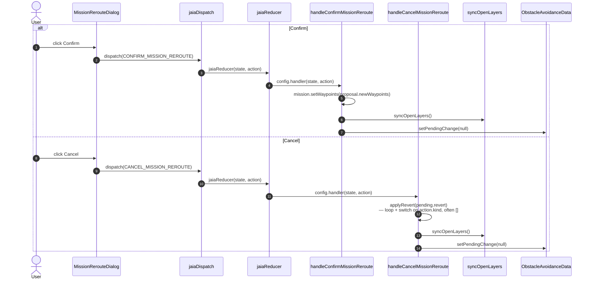

# Obstacle avoidance: two event streams

_Status: reference documentation, current as of the zone-handler bug fixes in
[`07KNOWN_BUGS.md`](./07KNOWN_BUGS.md) (Bugs 4, 6, 9, 11)._

The system is a fan-in / fan-out, not a single pipeline: **13 producer
functions** across 4 handler files each apply a user edit immediately and
_stage_ a proposal; **5 consumer functions** in one file resolve whatever
got staged, regardless of which producer staged it.

Deliberately no line numbers below — they go stale faster than the structure
does. Names are the stable handle.

## 1. Architecture: fan-in → shared contract → fan-out

**Key point:** stream 2 never inspects which producer fired. It branches
only on `pending.type` (`reroute` / `waypointRemoval` / `placementError`),
then — for the two revert handlers — loops over `pending.data.revert:
RevertContext[]` via a shared `applyRevert` helper and `switch`es on each
action's `kind`: `deleteZone`, `restoreZoneShape`, `restoreWaypoints`,
`restoreMissionSnapshot`, or `restoreZoneSetSnapshot`. That list, plus an
optional `loadSummary` on `PendingReroute` (producer context for the
load-flow dialog UI and `handleConfirmMissionReroute`'s
already-deleted-missions guard — never read by the cancel handlers), is the
entire contract between the two streams.

`revert` is frequently `[]`. Detection
(`detectMissionReroutes`/`detectWaypointRemovals`) never mutates the data
model — only confirming a dialog does — so while a load-triggered dialog is
pending, the missions/zones are already sitting exactly as loaded. Cancel
on those just declines the proposal and closes the dialog; there's nothing
to undo, and the load itself is deliberately out of `revert`'s scope (see
Bug 7 in [`07KNOWN_BUGS.md`](./07KNOWN_BUGS.md)). `handleDeleteExclusionZone`
stages an empty `revert` for the same reason: the deletion is the operator's
own deliberate act and stands regardless of what they decide about the route.

The dialogs read this directly — a dismissal button labelled "Revert" when
there is something to undo and "Cancel" when `revert` is empty.

`placementError` is a third, simpler case: for those, the producer already
reverted its own edit synchronously _before_ staging the dialog (see
`handleAddWaypoint`'s `OVER_LIMIT`/`IMPOSSIBLE` branches below), so the only
consumer is a plain dismiss — `handleClearPlacementError` — with nothing
left to revert.

**`PlacementErrorDialog` has a second, parallel path that bypasses this
machinery entirely.** `Map.tsx` raises its own placement errors from local
`useState` and renders the dialog directly, dismissing it through the
component's optional `onDismiss` prop rather than `CLEAR_PLACEMENT_ERROR`. So
the dialog has two producers and two consumers, only one pair of which appears
in the streams above. Nothing is wrong with it — a message computed in the
component with no shared state to coordinate does not need the reducer — but
`pendingChange` is not the only way that dialog reaches the screen.

## 2. Stream 1 — producers

Every row: apply the primitive edit → run `detectWaypointRemovals()` /
`detectMissionReroutes()` (both zero-argument, pure functions) → stage a
proposal with a `revert` list attached (or self-revert and show a blocking
error).

| File                       | Function                             | Stages                    |
| -------------------------- | ------------------------------------ | ------------------------- |
| exclusion-zone-handlers.ts | `handleAddExclusionZone`             | waypointRemoval · reroute |
|                            | `handleDeleteExclusionZone`          | waypointRemoval · reroute |
|                            | `handleLoadExclusionZones`           | waypointRemoval · reroute |
|                            | `handleRestoreExclusionZoneSnapshot` | waypointRemoval · reroute |
|                            | `handleMoveZoneVertex`               | waypointRemoval · reroute |
|                            | `handleAddZoneVertex`                | waypointRemoval · reroute |
|                            | `handleDeleteZoneVertex`             | waypointRemoval · reroute |
| waypoint-handlers.ts       | `handleAddWaypoint`                  | placementError · reroute  |
|                            | `handleDeleteWaypoint`               | placementError · reroute  |
|                            | `handleMoveWaypoint`                 | placementError · reroute  |
| mission-handlers.ts        | `handleDuplicateMission`             | waypointRemoval · reroute |
|                            | `handleLoadMissionSet`               | waypointRemoval · reroute |
| survey-handlers.ts         | `handleChangeGridPlanningState`      | waypointRemoval · reroute |

None of the seven zone handlers stages a proposal itself any more. Each applies
its own edit, then delegates to one of two shared sequences in the same file:

- **`applyZoneMutation`** — for the six handlers that change one zone. Runs
  waypoint-removal detection (which short-circuits the rest if it finds
  anything, since a waypoint inside a zone takes priority over routing around
  it), strips detour waypoints the changed zone now contains, runs reroute
  detection, and finally discards detours no longer needed. Each caller passes
  which of those steps apply and what to revert.
- **`applyZoneSetReplacement`** — for the two that replace the whole set
  (load and snapshot restore). Drops zones that would leave a mission
  unroutable and reports what survived through `loadSummary`.

Collapsing the sequence into one place is what made the zone-handler bugs
visible: each was a step one handler skipped, which reads as a missing table
row rather than as absent code. The steps a handler skips are now stated at its
call site.

## 3. Stream 2 — consumers

All five, plus the shared `applyRevert` helper they both call, live in
`obstacle-avoidance-handlers.ts`. Only these functions ever mutate a
mission based on a _proposal_ (insert bypass waypoints, delete an
unroutable mission, or revert).

| Function                       | On the wire from           | Does                                                                                                         |
| ------------------------------ | -------------------------- | ------------------------------------------------------------------------------------------------------------ |
| `applyRevert` (helper)         | —                          | loops `RevertContext[]`, `switch`es on `kind`; called by both cancel handlers below                          |
| `handleConfirmMissionReroute`  | `CONFIRM_MISSION_REROUTE`  | writes `proposal.newWaypoints` into each mission; deletes `OVER_LIMIT`/`IMPOSSIBLE` missions unconditionally |
| `handleCancelMissionReroute`   | `CANCEL_MISSION_REROUTE`   | `applyRevert(pending.revert)` — a no-op whenever `revert` is empty                                           |
| `handleConfirmWaypointRemoval` | `CONFIRM_WAYPOINT_REMOVAL` | applies the removal proposal, plus any feasible follow-up reroute, in one operation                          |
| `handleCancelWaypointRemoval`  | `CANCEL_WAYPOINT_REMOVAL`  | `applyRevert(pending.revert)`, scoped to the removal's staged data                                           |
| `handleClearPlacementError`    | dismiss                    | clears the dialog only — the producer already self-reverted                                                  |

`handleConfirmMissionReroute` deleting unroutable missions is why it matters
that no mission reaches reroute detection with a waypoint already inside a
zone: routing reports any leg touching such a waypoint as impossible, and
confirm would then delete a mission that was never actually unroutable. Every
zone producer runs waypoint-removal detection first to keep that from
happening (Bug 11).

## 4. Stream 1 in detail — one producer, worked example

`handleAddExclusionZone` is representative of the pattern all 13 producers
follow. The detection steps shown inside the handler are the ones
`applyZoneMutation` now performs on its behalf; the sequence is unchanged.

Note the absence of any relevance filter here — earlier versions of this
handler filtered `pending.proposals` down to ones attributable to `zoneID`
before staging (Bug 3 in [`07KNOWN_BUGS.md`](./07KNOWN_BUGS.md)); the fixed
version stages `pending` directly, trusting `detectMissionReroutes()`'s own
comparison against the mission's current route.

## 5. Stream 2 in detail — resolving a reroute proposal

`handleConfirmWaypointRemoval` / `handleCancelWaypointRemoval` are
structurally identical to this pair — same dispatch → reducer → handler →
`syncOpenLayers` → `setPendingChange(null)` shape — just resolving
`pendingState.data` for a `"waypointRemoval"` instead of a `"reroute"`.
