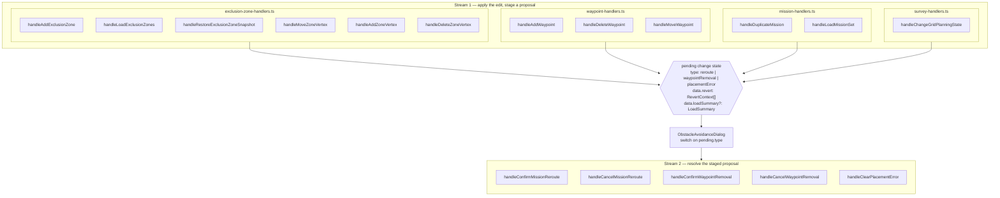
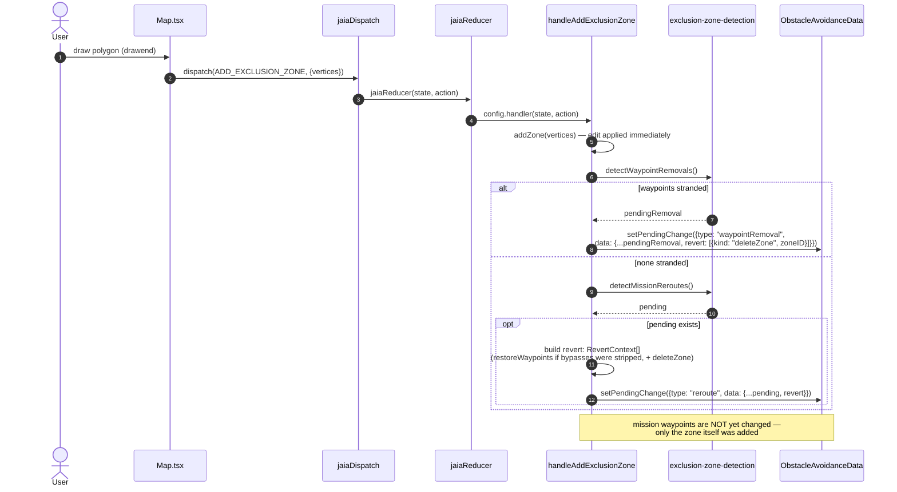
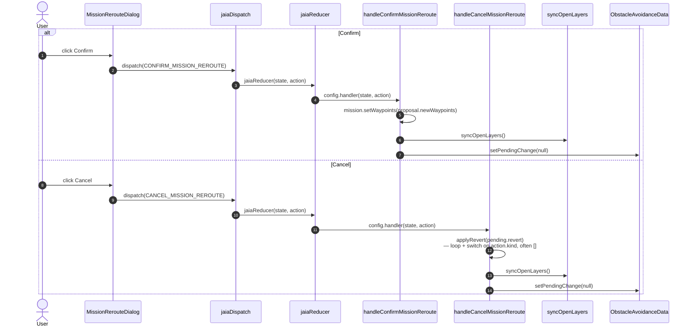

# Obstacle avoidance: two event streams

_Status: reference documentation, current as of
[`04EXCLUSION_ZONE_HANDLERS_PLAN.md`](./04EXCLUSION_ZONE_HANDLERS_PLAN.md)
and [`07KNOWN_BUGS.md`](./07KNOWN_BUGS.md)'s Bug 7 fix._

The system is a fan-in / fan-out, not a single pipeline: **12 producer
functions** across 4 handler files each apply a user edit immediately and
_stage_ a proposal; **5 consumer functions** in one file resolve whatever
got staged, regardless of which producer staged it.

## 1. Architecture: fan-in → shared contract → fan-out

**Key point:** stream 2 never inspects which producer fired. It branches
only on `pending.type` (`reroute` / `waypointRemoval` / `placementError`),
then — for the two revert handlers — loops over `pending.data.revert:
RevertContext[]` via a shared `applyRevert` helper and `switch`es on each
action's `kind`: `deleteZone`, `restoreZoneShape`, `restoreWaypoints`,
`restoreMissionSnapshot`, or `restoreZoneSetSnapshot`. That list, plus an
optional `loadSummary` on `PendingReroute` (producer context for the
load-flow dialog UI and `handleConfirmMissionReroute`'s
already-deleted-missions guard — never read by the cancel handlers), is the
entire contract between the two streams.

`revert` is frequently `[]` for load-triggered dialogs. Detection
(`detectMissionReroutes`/`detectWaypointRemovals`) never mutates the data
model — only confirming a dialog does — so while a load-triggered dialog is
pending, the missions/zones are already sitting exactly as loaded. Cancel
on those just declines the proposal and closes the dialog; there's nothing
to undo, and the load itself is deliberately out of `revert`'s scope (see
Bug 7 in [`07KNOWN_BUGS.md`](./07KNOWN_BUGS.md)).

`placementError` is a third, simpler case: for those, the producer already
reverted its own edit synchronously _before_ staging the dialog (see
`handleAddWaypoint`'s `OVER_LIMIT`/`IMPOSSIBLE` branches below), so the only
consumer is a plain dismiss — `handleClearPlacementError` — with nothing
left to revert.

## 2. Stream 1 — producers

Every row: apply the primitive edit → run `detectWaypointRemovals()` /
`detectMissionReroutes()` (both zero-argument, pure functions) → stage a
proposal with a `revert` list attached (or self-revert and show a blocking
error).

| File                       | Function                             | Line                                                             | Stages                                         |
| -------------------------- | ------------------------------------ | ---------------------------------------------------------------- | ---------------------------------------------- |
| exclusion-zone-handlers.ts | `handleAddExclusionZone`             | [25](../../../context/handlers/exclusion-zone-handlers.ts#L25)   | waypointRemoval (36) · reroute (60)            |
|                            | `handleLoadExclusionZones`           | [112](../../../context/handlers/exclusion-zone-handlers.ts#L112) | waypointRemoval (139, 146) · reroute (171)     |
|                            | `handleRestoreExclusionZoneSnapshot` | [205](../../../context/handlers/exclusion-zone-handlers.ts#L205) | waypointRemoval (218) · reroute (245)          |
|                            | `handleMoveZoneVertex`               | [301](../../../context/handlers/exclusion-zone-handlers.ts#L301) | waypointRemoval (328) · reroute (358)          |
|                            | `handleAddZoneVertex`                | [422](../../../context/handlers/exclusion-zone-handlers.ts#L422) | waypointRemoval (450) · reroute (480)          |
|                            | `handleDeleteZoneVertex`             | [496](../../../context/handlers/exclusion-zone-handlers.ts#L496) | reroute (515)                                  |
| waypoint-handlers.ts       | `handleAddWaypoint`                  | [34](../../../context/handlers/waypoint-handlers.ts#L34)         | placementError (41, 53, 69, 79) · reroute (98) |
|                            | `handleDeleteWaypoint`               | [113](../../../context/handlers/waypoint-handlers.ts#L113)       | placementError (137, 146) · reroute (154)      |
|                            | `handleMoveWaypoint`                 | [179](../../../context/handlers/waypoint-handlers.ts#L179)       | placementError (182, 219, 228) · reroute (237) |
| mission-handlers.ts        | `handleDuplicateMission`             | [64](../../../context/handlers/mission-handlers.ts#L64)          | waypointRemoval (88) · reroute (95)            |
|                            | `handleLoadMissionSet`               | [190](../../../context/handlers/mission-handlers.ts#L190)        | waypointRemoval (215) · reroute (236)          |
| survey-handlers.ts         | `handleChangeGridPlanningState`      | [27](../../../context/handlers/survey-handlers.ts#L27)           | waypointRemoval (112) · reroute (119)          |

## 3. Stream 2 — consumers

All five, plus the shared `applyRevert` helper they both call, live in
`obstacle-avoidance-handlers.ts`. Only these functions ever mutate a
mission based on a _proposal_ (insert bypass waypoints, delete an
unroutable mission, or revert).

| Function                       | Line                                                                 | On the wire from           | Does                                                                                                         |
| ------------------------------ | -------------------------------------------------------------------- | -------------------------- | ------------------------------------------------------------------------------------------------------------ |
| `applyRevert` (helper)         | [15](../../../context/handlers/obstacle-avoidance-handlers.ts#L15)   | —                          | loops `RevertContext[]`, `switch`es on `kind`; called by both cancel handlers below                          |
| `handleConfirmMissionReroute`  | [47](../../../context/handlers/obstacle-avoidance-handlers.ts#L47)   | `CONFIRM_MISSION_REROUTE`  | writes `proposal.newWaypoints` into each mission; deletes `OVER_LIMIT`/`IMPOSSIBLE` missions unconditionally |
| `handleCancelMissionReroute`   | [75](../../../context/handlers/obstacle-avoidance-handlers.ts#L75)   | `CANCEL_MISSION_REROUTE`   | `applyRevert(pending.revert)` — often a no-op for load-triggered dialogs                                     |
| `handleConfirmWaypointRemoval` | [94](../../../context/handlers/obstacle-avoidance-handlers.ts#L94)   | `CONFIRM_WAYPOINT_REMOVAL` | applies the removal proposal, plus any feasible follow-up reroute, in one operation                          |
| `handleCancelWaypointRemoval`  | [130](../../../context/handlers/obstacle-avoidance-handlers.ts#L130) | `CANCEL_WAYPOINT_REMOVAL`  | `applyRevert(pending.revert)`, scoped to the removal's staged data                                           |
| `handleClearPlacementError`    | [148](../../../context/handlers/obstacle-avoidance-handlers.ts#L148) | dismiss                    | clears the dialog only — the producer already self-reverted                                                  |

## 4. Stream 1 in detail — one producer, worked example

`handleAddExclusionZone` is representative of the pattern all 12 producers
follow.

Note the absence of any relevance filter here — earlier versions of this
handler filtered `pending.proposals` down to ones attributable to `zoneID`
before staging (Bug 3 in [`07KNOWN_BUGS.md`](./07KNOWN_BUGS.md)); the fixed
version stages `pending` directly, trusting `detectMissionReroutes()`'s own
comparison against the mission's current route.

## 5. Stream 2 in detail — resolving a reroute proposal

`handleConfirmWaypointRemoval` / `handleCancelWaypointRemoval` are
structurally identical to this pair — same dispatch → reducer → handler →
`syncOpenLayers` → `setPendingChange(null)` shape — just resolving
`pendingState.data` for a `"waypointRemoval"` instead of a `"reroute"`.
