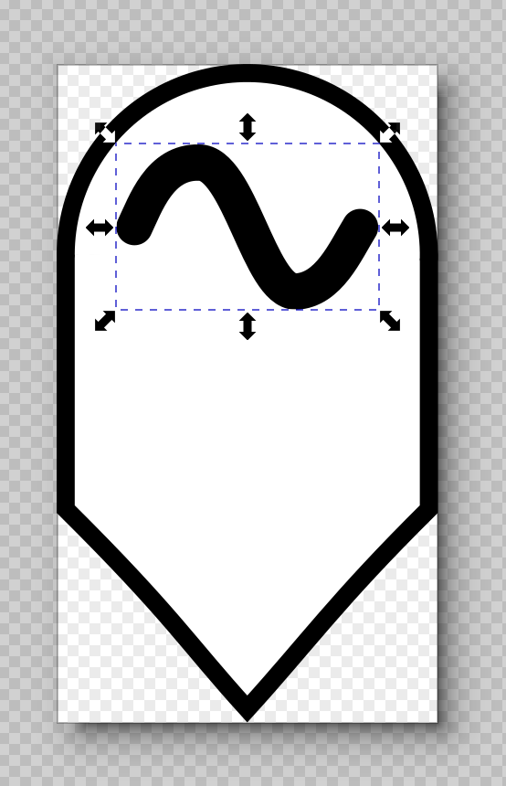
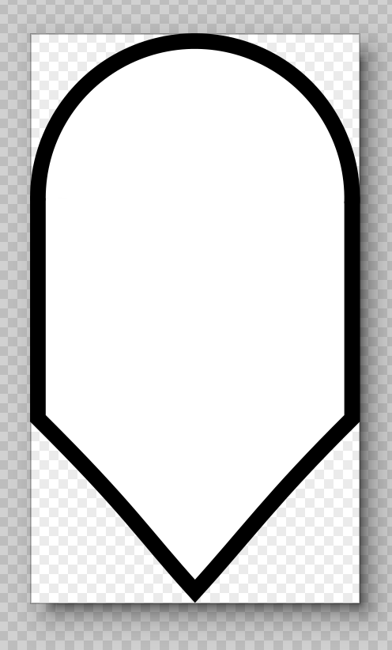

## Waypoint icons

Waypoint icons are created in the fully scalable SVG file format. This makes them resolution-independent. These icons were created using the `Inkscape` application, which is an open source application for creating and editing SVG files, although the files should be compatible with most vector graphics applications.

The `taskNone.svg` file is the default waypoint icon, which shows a shield-shaped anchor pointing downward to the waypoint's exact coordinates.

The other `task*.svg` files correspond to waypoints with an associated task, such as diving or drifting. These icons are composed of a taller version of the shield, with a task icon appearing within the shield. The task icon is a separate layer from the shield icon.

### Creating a new icon

To create a new waypoint icon with a new type of task, it's easiest to open an existing task, such as `taskDive.svg`, and remove the layer showing the task icon.




While the task icon layer is selected, pressing the `Delete` key will delete the layer. Now, you can compose you're own task icon, or import one from an online icon library. If you keep your task icon as a separate layer, it will be easier to replace the icon later, if you want to change the icon's appearance.

### Using the icon

To use the icon, we use the `require` keyword in JavaScript:

```
const taskDive = require('./taskDive.svg') as string
const taskDrift = require('./taskDrift.svg') as string
export const taskNone = require('./taskNone.svg') as string
const taskStationKeep = require('./taskStationKeep.svg') as string
const taskConstantHeading = require('./taskConstantHeading.svg') as string
```

Using `require` rather than `import` allows us to use the `as` keyword to define the type of the variable for TypeScript.
